# Tutorial: quickMeet

QuickMeet is a web application for **real-time video conferencing**.
It allows users to **create and join meetings**, facilitating **live audio/video streaming**
and featuring **real-time chat** and **speech-to-text transcription**.
Meeting history, transcripts, and summaries are **persisted** for later review.


## Visual Overview

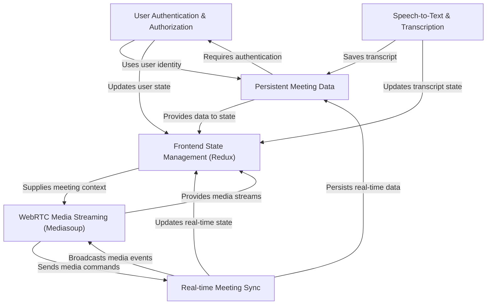
### Screens
🖥️ Sign In Page
<p align="center"> 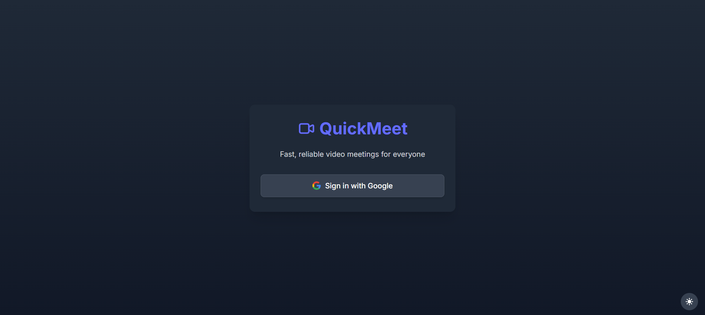 &nbsp; 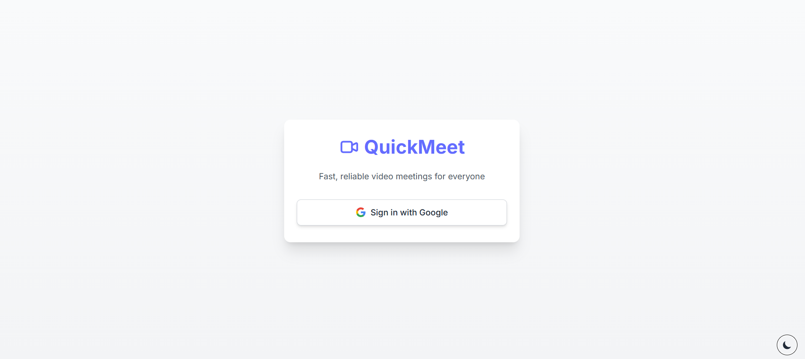 </p> <p align="center"><em>Sign in page – Dark Mode (left), Light Mode (right)</em></p>

🏠 Home Page
<p align="center"> 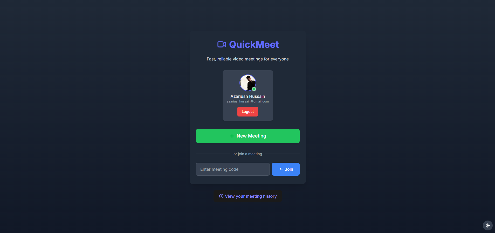 &nbsp; 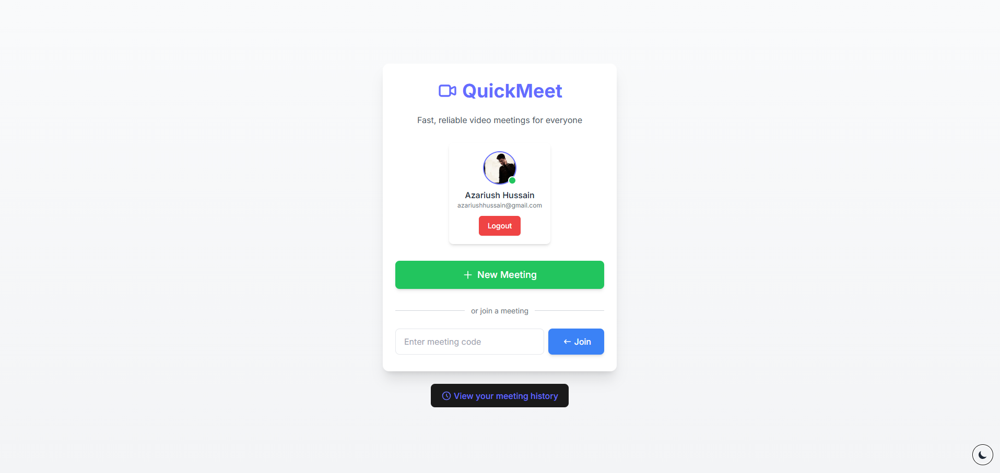 </p> <p align="center"><em>Home page – Dark Mode (left), Light Mode (right)</em></p>

🔐 Permissions Page
<p align="center"> 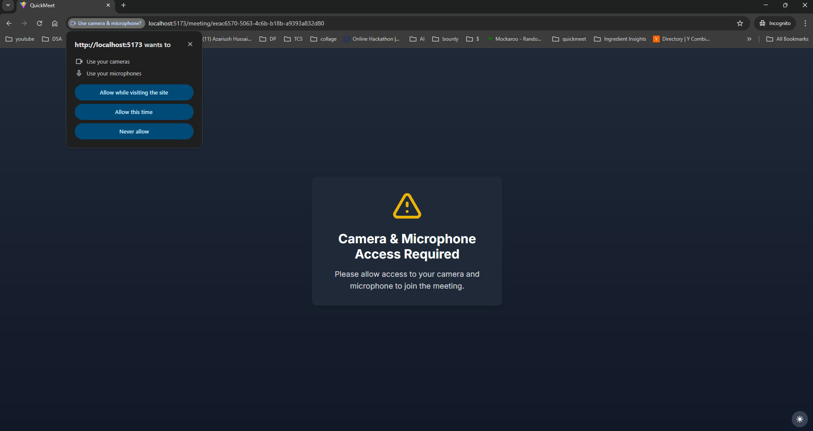 </p> <p align="center"><em>Permissions page – Dark Mode</em></p>

🔍 Preview Page
<p align="center"> 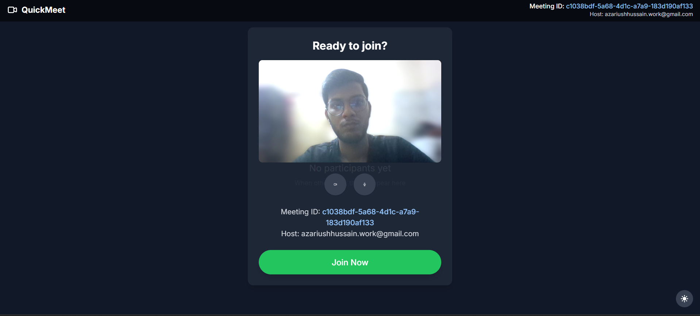 </p> <p align="center"><em>Preview page – Dark Mode</em></p>

🎛️ Preview Controls in Action
<p align="center"> 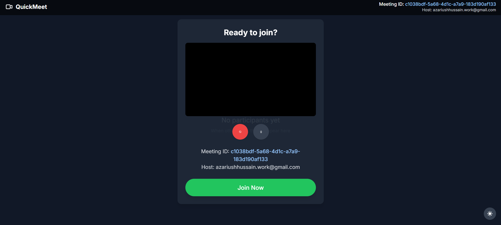 </p> <p align="center"><em>Preview controls in action – Dark Mode</em></p>

🧑‍💼 In-Meeting Experience
<p align="center"> 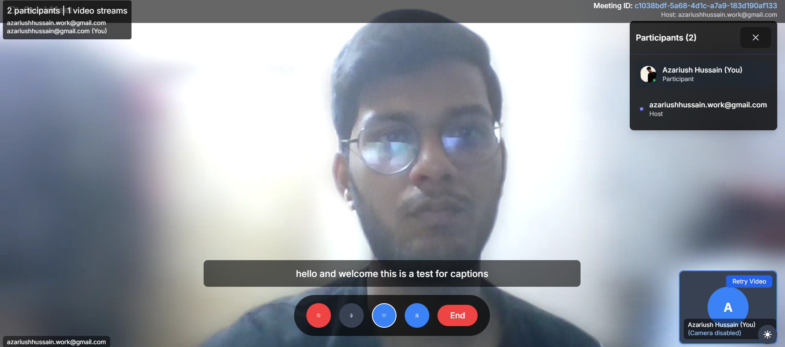 </p> <p align="center"><em>Meeting room with captions, participants list, and controls – Dark Mode</em></p>

📅 Meeting History
<p align="center"> 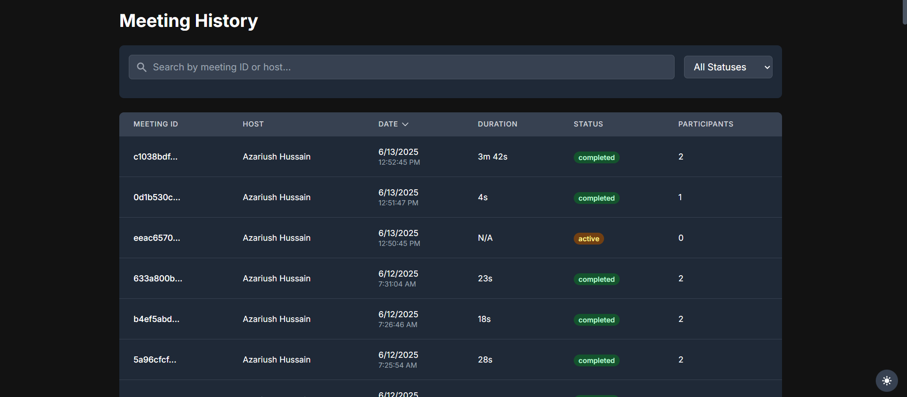 </p> <p align="center"><em>Meeting history with filters for status and date – Dark Mode</em></p>

📜 Transcript View
<p align="center"> 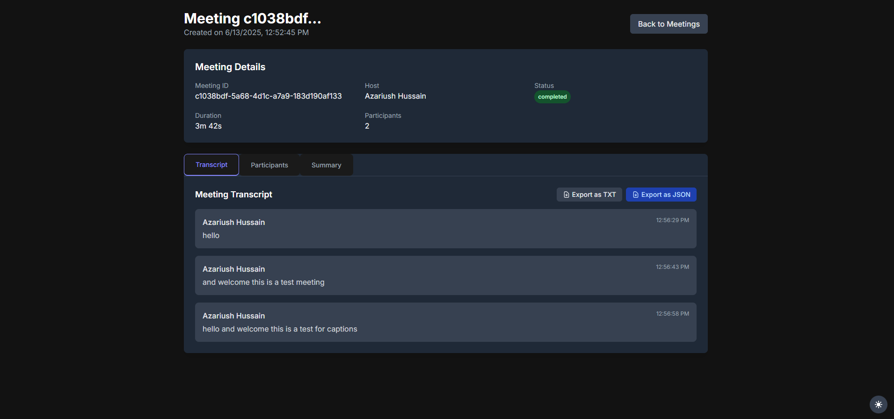 </p> <p align="center"><em>Meeting details page with transcript section – Dark Mode</em></p>

👥 Participants Timeline
<p align="center"> 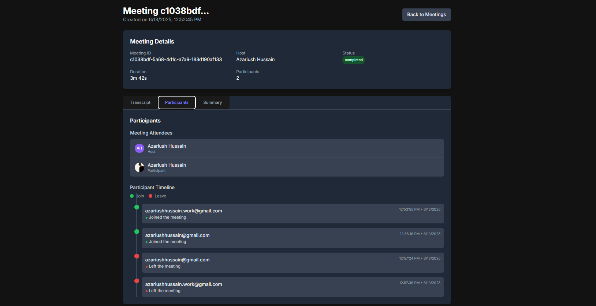 </p> <p align="center"><em>Meeting details page showing participants' timeline – Dark Mode</em></p>

🧾 Meeting Summary
<p align="center"> 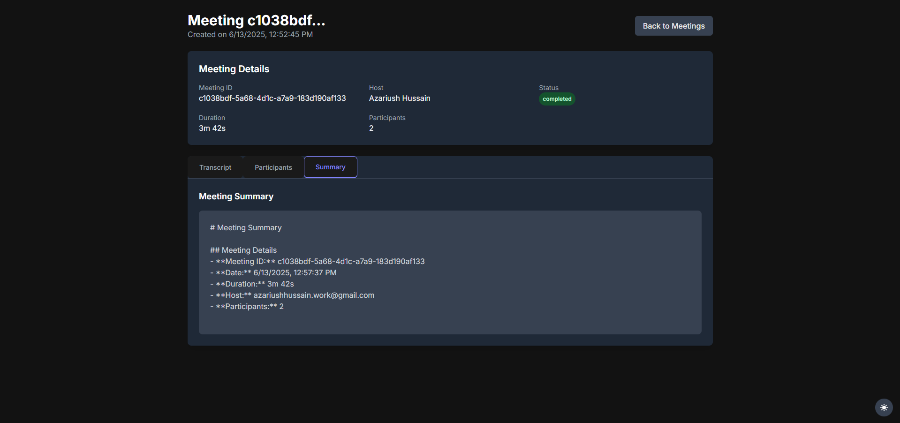 </p> <p align="center"><em>Meeting summary section – Dark Mode</em></p>

## Chapters

1. Real-time Meeting Sync
2. User Authentication & Authorization
3. Persistent Meeting Data
4. WebRTC Media Streaming (Mediasoup)
5. Frontend State Management (Redux)
6. Speech-to-Text & Transcription
---

Show Rendered
# Chapter 1: Real-time Meeting Sync

Welcome to the first chapter of the quickMeet tutorial! In this chapter, we'll explore one of the fundamental concepts that makes a meeting application feel responsive and alive: **Real-time Meeting Sync**.

Imagine you're in a video call. If someone sends a message, leaves the call, or turns on their camera, you expect to see that happen almost instantly. You don't want to click a "Refresh" button every few seconds to check for updates! This instant feeling is what we mean by "real-time sync".

### The Problem: Keeping Everyone Updated

Think about a typical website. When you visit a page, your browser sends a request to the server (an HTTP request). The server finds the information you need and sends it back. This works great for static pages or refreshing content occasionally.

But in a meeting with multiple people, information is constantly changing:
*   Someone new joins.
*   Someone leaves.
*   Someone sends a chat message.
*   Someone starts talking (transcription updates).
*   Someone shares their video.

If everyone's browser had to *ask* the server repeatedly "Is there anything new?", it would be very inefficient. The server would get bombarded with requests, and there would always be a slight delay between something happening and others seeing it. This is like trying to have a conversation by sending letters back and forth!

### The Solution: Real-time Communication

QuickMeet solves this by using a more direct form of communication that allows the server to *push* updates to clients as soon as they happen. This is our **Real-time Meeting Sync**.

It uses two key technologies working together:

1.  **WebSockets (Socket.IO):** Think of this like opening a dedicated phone line between your browser and the quickMeet server. Once the line is open, either your browser or the server can send messages back and forth instantly, without needing to hang up and dial again for each new piece of information. Socket.IO is a library that makes using WebSockets easier and more reliable.
2.  **Message Broker (Redis Pub/Sub):** As quickMeet grows and handles many meetings, you might have multiple servers running in the backend. If a user joins Meeting A on Server 1, how does Server 2 know to tell its users (also in Meeting A) about the new participant? This is where a message broker like Redis comes in. It acts like a central news agency. When something important happens (like a participant joining), Server 1 "publishes" a message about it to a specific "channel" in Redis. Any other server that is "subscribed" to that channel (because it also has clients in that meeting) will receive the message from Redis and can then tell its clients.

### How it Works for a Use Case: A Participant Joins

Let's trace what happens when a new participant joins a meeting using Real-time Sync.

Imagine User A is already in a meeting, and User B joins. Here's the simplified flow:

1.  **User B's Frontend:** When User B clicks "Join", their browser doesn't just send a one-time HTTP request. Instead, it establishes a persistent WebSocket connection with the quickMeet backend server using Socket.IO.
2.  **User B's Frontend:** It then sends a specific "joined" message to the backend over this new WebSocket connection, including details like the meeting ID and User B's info.
3.  **Backend Server (receiving User B's message):** The server receives the "joined" message via Socket.IO. It processes this – maybe adds the user to a list in a temporary store (like Redis) and maybe records it more permanently ([Persistent Meeting Data
    ](03_persistent_meeting_data_.md)).
4.  **Backend Server:** Now, it needs to tell *everyone else* in that meeting that User B has joined. Instead of talking directly to each connected user's WebSocket (which is hard if users are on *different* backend servers), it "publishes" a "PARTICIPANT\_JOINED" event message to a specific channel in the Redis message broker (like a channel named after the meeting ID).
5.  **Redis Message Broker:** Redis receives the message on that channel. It then automatically forwards this message to *all* backend servers that have subscribed to that specific meeting channel.
6.  **Backend Servers (receiving message from Redis):** Any backend server that receives the "PARTICIPANT\_JOINED" message from Redis (including the server User B joined on, and potentially other servers hosting other meeting participants) processes it.
7.  **Backend Servers:** Each server receiving the message then uses its Socket.IO connection to "broadcast" a "PARTICIPANT\_JOINED" event to all *frontend clients* it knows are connected to that specific meeting.
8.  **All Participants' Frontends:** User A's frontend (and any other participant's frontend) receives the "PARTICIPANT\_JOINED" event instantly via their open WebSocket connection.
9.  **All Participants' Frontends:** The frontend code handles this event, updates the list of participants displayed on the screen, and potentially starts setting up to receive User B's video ([WebRTC Media Streaming (Mediasoup)
    ](04_webrtc_media_streaming__mediasoup__.md)).

This entire process happens in milliseconds, creating the feeling of real-time sync!

Here's a simple diagram illustrating this flow:

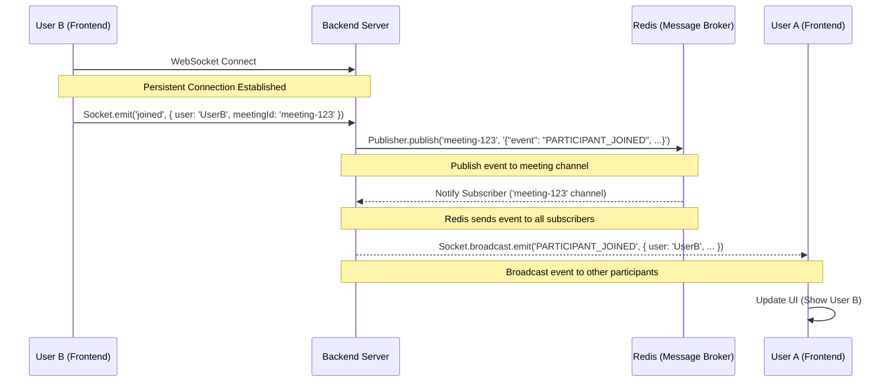

### Looking at the Code

Let's peek at how this looks in the `quickMeet` code, focusing on the core parts of the sync mechanism.

**1. Setting up Socket.IO on the Backend (`backend/app.js`)**

The main application file sets up the standard Node.js HTTP server and then attaches Socket.IO to it.

```javascript
// ... other imports
const http = require('http');
const { Server } = require('socket.io');
// ... other requires

const app = express();
// Create a standard HTTP server
const server = http.createServer(app);

// Attach Socket.IO to the HTTP server
const io = new Server(server, {
    cors: {
        origin: '*', // Allows connections from any origin during development
        methods: ['GET', 'POST']
    }
});

// Pass the Socket.IO instance to the mediasoup controller
mediasoupController(io);

// ... server start
```

This code creates the WebSocket server (`io`) that frontend clients will connect to.

**2. Connecting to Redis on the Backend (`backend/utils/redis.js`)**

This file handles the connection to Redis, setting up both a `publisher` (to send messages) and a `subscriber` (to receive messages).

```javascript
const redis = require('redis');

// Create a Redis client instance for publishing
const publisher = redis.createClient({
    url: process.env.REDIS_URL, // Your Redis server URL
});

// Create another Redis client instance for subscribing
const subscriber = redis.createClient({
    url: process.env.REDIS_URL, // Your Redis server URL
});

// ... connection handling and connect() calls
```

We use separate clients for publishing and subscribing as recommended by Redis libraries.

**3. Subscribing to Events in Redis (`backend/utils/redis.js`)**

The subscriber needs to listen for messages on specific channels. In quickMeet, channels are often related to meeting IDs or general event types.

```javascript
// ... previous redis client setup

(async () => {
    try {
        await publisher.connect();
        await subscriber.connect();

        // Subscribe to channels we care about for real-time sync
        const channels = ['MESSAGE', 'TYPING', 'NEW_PRODUCER', 'PARTICIPANT_JOINED', 'PARTICIPANT_LEFT'];
        await subscriber.subscribe(channels, (message, channel) => {
            console.log(`Received message from ${channel}`);
            const parsedMessage = JSON.parse(message);
            // Call a handler function when a message is received
            handleIncomingMessage(channel, parsedMessage);
        });
    } catch (error) {
        console.error('Redis connection error:', error);
    }
})();

// ... handleIncomingMessage and other functions
```

This code connects the subscriber and tells it to listen on a list of channels. When a message arrives on any of these channels, the `handleIncomingMessage` function is called.

**4. Handling Incoming Redis Messages and Broadcasting via Socket.IO (`backend/utils/redis.js`)**

When `handleIncomingMessage` is called, it receives the channel and the message payload. For our real-time sync, the main action is to send this message out to relevant connected WebSocket clients.

```javascript
// ... subscriber setup and connection

function handleIncomingMessage(channel, payload) {
    // This function decides what to do based on the channel
    switch (channel) {
        case 'MESSAGE':
        case 'TYPING':
        case 'NEW_PRODUCER': // Related to media streams ([WebRTC Media Streaming (Mediasoup)](04_webrtc_media_streaming__mediasoup__.md))
        case 'NEW_CONSUMER': // Related to media streams ([WebRTC Media Streaming (Mediasoup)](04_webrtc_media_streaming__mediasoup__.md))
        case 'PARTICIPANT_JOINED':
        case 'PARTICIPANT_LEFT':
            console.log(`Broadcasting ${channel} event`);
            // Send the event to all connected WebSocket clients (broadcast)
            broadcastToWebSocketClients(channel, payload);
            break;
        default:
            console.log(`Unhandled channel: ${channel}`);
    }
}

// Function to actually send the message via Socket.IO
function broadcastToWebSocketClients(channel, payload) {
    // 'io' is the Socket.IO server instance, set previously
    // 'socket' is often the specific socket that triggered an event,
    // but for broadcasting from Redis, we need the general 'io' instance
    // Note: The provided code snippet in redis.js has a potential issue
    // using a single `socket` variable for broadcasting.
    // A more robust approach in a scaled setup would involve
    // Socket.IO's adapter (like the Redis adapter) or ensuring 'io' is accessible.
    // For simplicity in this example:
    if (io) { // Assuming 'io' is correctly accessible here
         // Emit to all connected clients. You might filter by meeting room later.
        io.emit(channel, payload);
         // A more specific broadcast for a meeting room would be:
        // io.to(payload.meetingId).emit(channel, payload);
         console.log(`Event ${channel} broadcasted via Socket.IO`);
    } else {
        console.warn("Socket.IO instance not available for broadcast.");
    }
}

// Function to publish events TO Redis
async function publishEvent(channel, payload) {
    try {
        const message = JSON.stringify(payload);
        await publisher.publish(channel, message);
        console.log(`Event published to ${channel}`);
    } catch (error) {
        console.error('Error publishing event:', error);
    }
}

// ... exports
```

This is the core of the server-side sync. `handleIncomingMessage` acts as a dispatcher for Redis events, and `broadcastToWebSocketClients` sends them out to everyone via Socket.IO. The `publishEvent` function is used by other parts of the backend to *trigger* these sync events.

**5. Handling the 'joined' Message from a User (`backend/controllers/mediasoupController.js`)**

This controller handles Socket.IO connections and messages related to the meeting.

```javascript
// ... imports and worker/router setup

module.exports = async (io) => { // 'io' is the Socket.IO server instance
  // ... worker/router setup

  io.on('connection', (socket) => { // Listen for new WebSocket connections
    console.log(`User connected: ${socket.id}`);
    // setIo(io, socket); // Note: This part of the original code sets a global socket,
                       // which works for single-user tests but needs adjustment for multi-user/broadcast.
                       // The broadcast logic in redis.js should ideally use the 'io' instance directly.

    // ... other socket event handlers

    // Handle the 'joined' event from a frontend client
    socket.on('joined', async (data, callback) => {
      console.log(`Participant joined:`, data);

      // Add participant info to Redis (used for temporary participant list)
      await addParticipant(data);

      // Get updated participant list (sent back to the joining client)
      const participants = await getParticipants(data.meetingId);
      callback({ data: participants }); // Send list back to the *joining* client

      // Publish the 'PARTICIPANT_JOINED' event to Redis
      // This triggers the sync mechanism for *other* participants
      await publishEvent('PARTICIPANT_JOINED', {
        ...data,
        needsStream: true,
        joinedAt: Date.now()
      });

      console.log(`Participant ${data.email} joined via WebSocket`);
    });

    // ... other socket event handlers (like 'left', 'message', 'typing')
  });
};
```

When a client sends the `'joined'` event over their WebSocket, this handler is triggered. It stores the participant data and, crucially, calls `publishEvent` to send a message to the Redis broker. This makes the event available for *all* backend servers subscribed to that meeting's channel.

**6. Connecting to Socket.IO on the Frontend (`frontend/src/hooks/useMediasoup.js`)**

The `useMediasoup` hook manages the client-side Socket.IO connection.

```javascript
import { useState, useEffect } from "react";
// ... other imports
import io from "socket.io-client"; // Import the Socket.IO client library
// ... other imports

// Establish the WebSocket connection
const socket = io("http://localhost:8000"); // Replace with your backend URL

export const useMediasoup = () => {
  // ... state and other hooks

  // Listen for the initial connection event
  socket.on('connect', () => {
    console.log("Connected to socket server");
  });

  // Listen for disconnection
  socket.on('disconnect', () => {
    console.log("Disconnected from socket server");
  });

  // ... other useEffects and functions
```

This simple line connects the frontend to the backend's Socket.IO server, opening the persistent "phone line".

**7. Sending the 'joined' Message from the Frontend (`frontend/src/hooks/useMediasoup.js`)**

When the user clicks the "Join Now" button in the `MeetingRoom.jsx` component, it triggers the `joinMeeting` function, which eventually calls `addParticipant` from the `useMediasoup` hook.

```javascript
// Inside useMediasoup hook...
const addParticipant = async (meetingId, producerId, email) => {
    return new Promise((resolve, reject) => {
      // ... validation and checks ...

      // Emit the 'joined' event to the backend via the WebSocket
      socket.emit("joined", { meetingId, producerId, email, ... }, async (response) => {
        if (response.error) {
          reject(response.error);
        } else {
          console.log("add participant response:", response.data);
          // Update Redux state with the initial participant list received from the server
          dispatch(setMeetingParticipants(response.data));
          // ... further local state updates and API calls ...
          resolve(response);
        }
      });
    });
  };
// ... other functions
```

This code sends the `joined` event to the server over the Socket.IO connection. The callback function handles the initial response from the server (the list of participants *at that moment*).

**8. Receiving Real-time Updates on the Frontend (`frontend/src/hooks/useMediasoup.js`)**

The frontend also needs to listen for the broadcasted events.

```javascript
// Inside useMediasoup hook...

  // Listen for the 'PARTICIPANT_JOINED' event broadcasted by the server
  socket.on("PARTICIPANT_JOINED", async (payload) => {
    console.log("Participant joined event in frontend:", payload);

    // ... validation and stream consumption logic ...

    // Update the Redux store to reflect the new participant
    dispatch(updateMeetingParticipants(participantData));

    // ... logic to consume media stream if needed ...
  });

  // Listen for the 'PARTICIPANT_LEFT' event
  socket.on("PARTICIPANT_LEFT", (payload) => {
    console.log("Participant left event:", payload);
    // Update local streams state
    setParticipantStreams(prevStreams => {
        // Find and stop the stream for the leaving participant
        // ... stream stopping logic ...
        // Return the filtered list
        return prevStreams.filter(s => s.email !== payload.email);
      });

      // Update consumers state
      setConsumers(prevConsumers => {
        // Find and close consumers associated with the leaving participant
        // ... consumer closing logic ...
        // Return the filtered list
        return prevConsumers.filter(c => c.producerId !== payload.producerId);
      });

    // Update the Redux store
    dispatch(removeMeetingPatricipant(payload));
  });

  // ... other socket listeners ('MESSAGE', 'TYPING', etc.)
```

These listeners are the core of receiving real-time updates. When the backend broadcasts an event (like `PARTICIPANT_JOINED` or `PARTICIPANT_LEFT`) via Socket.IO, this code runs instantly. It receives the payload and updates the local state (like the list of `participantStreams` and `consumers`) and the Redux store, triggering UI changes to show or hide participants in real-time.

### Summary

Real-time Meeting Sync is the magic that makes quickMeet feel responsive. By using **WebSockets (Socket.IO)** for persistent connections between frontend and backend, and a **Message Broker (Redis Pub/Sub)** to efficiently distribute events between potentially multiple backend servers, quickMeet ensures that everyone in a meeting is updated almost instantly when something happens, without constantly asking the server for updates. This is crucial for everything from chat messages to seeing who just joined or left, and even preparing for receiving their video and audio streams, which we'll cover in a later chapter.

Now that we understand how participants are notified about changes in the meeting, let's look at how we ensure only the right people can access and participate in a meeting.

[Next Chapter: User Authentication & Authorization]

---

Show Rendered
# Chapter 2: User Authentication & Authorization

Welcome to Chapter 2 of the quickMeet tutorial! In the previous chapter, [Real-time Meeting Sync](01_real_time_meeting_sync_.md), we learned how to make sure everyone in a meeting sees updates happen instantly, like someone joining or sending a message, using WebSockets and Redis.

But seeing updates is one thing; making sure *only the right people* can join a meeting or perform certain actions is another. Imagine if anyone could just stumble into your private meeting! This is where **User Authentication & Authorization** comes in.

### The Problem: Who Are You, and What Can You Do?

Think of quickMeet like a private club or perhaps even your home. You wouldn't let just anyone walk in off the street. You need a way to:

1.  **Authenticate** visitors: Check their ID at the door to confirm *who* they are. ("Are you a member? Let me see your ID.")
2.  **Authorize** actions: Once inside, they might be allowed to sit in certain areas, but perhaps only club staff can access the kitchen. ("Okay, you're a member, you can access the lounge, but you can't go behind the bar.")

In a web application like quickMeet:

*   **Authentication:** Is this person really the user they claim to be (e.g., John Doe)? We need a secure way for them to "log in" or "sign up" and for our system to verify their identity.
*   **Authorization:** Once we know this is John Doe, is John Doe allowed to create a *new* meeting? Is he allowed to join *this specific* meeting? Is he allowed to *kick* someone out of the meeting?

Without these two things, quickMeet would be chaotic and insecure. Any user could potentially access any meeting, impersonate others, or mess with data.

### The Solution: Sign In, Get a Token, Prove Your Identity

quickMeet uses a standard approach to handle this, making it easy for users and secure for the application:

1.  **Easy Sign-in (via Google/Firebase):** Instead of building a complex username/password system from scratch, quickMeet leverages Firebase Authentication, which makes it simple for users to sign in using their existing Google account. Firebase securely handles the initial identity check.
2.  **User Account in Database:** When a user signs in via Google for the first time, quickMeet creates a corresponding user record in its own database (MongoDB). This links their external Google identity (like their Google unique ID and email) to an internal quickMeet user ID.
3.  **Secure Token (JWT):** After the backend confirms the user's identity (either they just signed up or they already exist), it issues a special, secure "pass" called a JSON Web Token (JWT). This token is like a temporary, signed ID card that the frontend client will hold.
4.  **Using the Token for Access:** For almost every interaction the frontend has with the backend that requires knowing *who* the user is (like creating a meeting, sending a chat message, or joining a meeting), the frontend sends this JWT along with the request. The backend receives the token, quickly verifies its signature (to make sure it hasn't been tampered with), and extracts the user's identity information from it. This proves the request is coming from a known, authenticated user without needing them to log in again for every single action.

### Use Case Walkthrough: Signing In with Google

Let's trace the steps when a brand new user signs into quickMeet using their Google account for the very first time.

1.  **User clicks "Sign in with Google":** On the quickMeet homepage, the user clicks the button.
2.  **Frontend talks to Firebase:** The quickMeet frontend uses the Firebase SDK to initiate the Google sign-in process.
3.  **Firebase handles Google Login:** The user sees the familiar Google login pop-up or redirect. They enter their Google credentials and grant quickMeet permission to see basic profile info (like email, name, profile picture). Google verifies the user's identity.
4.  **Firebase gives info back to Frontend:** Upon successful Google login, Firebase securely tells the quickMeet frontend about the authenticated Google user, providing their unique Google ID (`uid`), name, email, and profile picture URL.
5.  **Frontend sends user info to quickMeet Backend:** The quickMeet frontend now takes this information received from Firebase and sends it to a specific login endpoint on the quickMeet backend. This isn't sending the Google password, just the verified identity details *from Google*.
6.  **Backend checks its Database:** The quickMeet backend receives the user's email or Google UID. It checks its own database (MongoDB) to see if a user with this email or UID already exists.
7.  **Backend Creates New User (if needed):** Since this is the *first* time this user is signing in, the backend won't find them in its database. It proceeds to create a *new* user record in its database using the information provided (name, email, Google UID, photo URL).
8.  **Backend Issues a Token:** Regardless of whether the user was just created or already existed, the backend now knows *who* this user is. It generates a special JWT that contains basic user information (like their quickMeet user ID, Google UID, email, name). This JWT is cryptographically signed by the backend, so the frontend (or anyone else) can't change its contents without invalidating it.
9.  **Backend sends Token to Frontend:** The backend sends the newly generated JWT back to the quickMeet frontend as part of the response to the login request.
10. **Frontend Stores User Info and Token:** The frontend receives the token and the user's information. It stores this in a secure place, like the browser's `localStorage` and the application's state management (Redux).
11. **Frontend is now Authenticated:** From this point on, whenever the frontend needs to make a request to the backend for a protected action (like creating a meeting), it includes the JWT in the request headers. The backend will then use this token to verify the user's identity (Authentication) and check if they are allowed to perform the action (Authorization).

Here's a simplified diagram of this process:

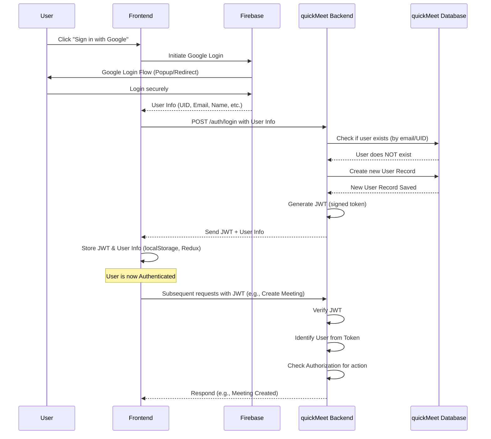

### Looking at the Code

Let's see how the pieces fit together in the quickMeet code.

**1. Frontend: Initiating Google Sign-in (`frontend/src/components/GoogleLoginButton.jsx`)**

This component handles the "Sign in with Google" button click.

```javascript
// ... imports (auth, provider, signInWithPopup from firebase.js)
// ... other imports (dispatch, useSelector, loginSuccess, loginUser)

export default function GoogleLoginButton() {
  const dispatch = useDispatch();
  const user = useSelector((state) => state.auth.user); // Check if user is already logged in

  const login = async () => {
    try {
      // Use Firebase to open the Google sign-in popup
      const result = await signInWithPopup(auth, provider);
      console.log("Firebase user data:", result.user); // Info from Firebase

      // Send this info to our backend to create/get user and get our token
      const response = await loginUser(result.user.uid, result.user.displayName, result.user.email, result.user.photoURL);

      // Dispatch action to update Redux state with user info and our token
      dispatch(loginSuccess({
          uid: result.user.uid,
          displayName: result.user.displayName,
          email: result.user.email,
          photoURL: result.user.photoURL,
          token: response.userToken // Our backend's JWT
      }));
    } catch (error) {
      console.error("Google Sign-in Error:", error);
    }
  };

  // ... logout function and JSX rendering the button
}
```

This code uses Firebase's `signInWithPopup` function. Once Firebase successfully authenticates the user via Google, it returns user data in `result.user`. We then take this data and call our *own* backend function `loginUser`.

**2. Frontend: Calling our Backend Login Endpoint (`frontend/src/api/user.js`)**

The `loginUser` function in `api/user.js` is a simple wrapper around an API call to our quickMeet backend.

```javascript
import axios from 'axios';

// Get the base URL for our backend API from environment variables
const API_URL= `${import.meta.env.VITE_APP_API_URL}/auth`

export const loginUser = async (uid, displayName, email, photoURL) => {
    // Send a POST request to the /auth/login endpoint on our backend
    const response = await axios.post(`${API_URL}/login`, { uid, displayName, email, photoURL });
    // The backend response contains our token and possibly user details
    return response.data.data; // Return the data part of the response (which includes the token)
}
```

This uses `axios` (a popular library for making HTTP requests) to send the user data obtained from Firebase to the `/auth/login` endpoint on our quickMeet backend.

**3. Frontend: Storing User & Token (`frontend/src/store/authSlice.js`)**

The Redux slice manages the application's state related to authentication.

```javascript
import { createSlice } from "@reduxjs/toolkit";

const initialState = {
  user: null, // Holds authenticated user info and the token
};

const authSlice = createSlice({
  name: "auth",
  initialState,
  reducers: {
    loginSuccess: (state, action) => {
      // When login is successful, update state with user info and token
      state.user = {
        uid: action.payload.uid, // Google UID
        displayName: action.payload.displayName,
        email: action.payload.email,
        photoURL: action.payload.photoURL,
        token: action.payload.token, // <-- Our backend's JWT!
      };
      // Store the user object (including token) in browser's local storage
      localStorage.setItem('user', JSON.stringify(state.user));
    },
    // ... logoutSuccess and setUserFromStorage reducers
  },
});

export const { loginSuccess, logoutSuccess,  setUserFromStorage} = authSlice.actions;
export default authSlice.reducer;
```

After the frontend gets the JWT from our backend, the `loginSuccess` Redux action is dispatched. This updates the application's state and saves the user object (which now includes the `token`) into `localStorage`. This allows the user to stay logged in even if they close and reopen the browser.

**4. Backend: Authentication Route (`backend/routes/authRoute.js`)**

This file defines the API endpoint the frontend calls.

```javascript
const express = require('express')
const { loginUser } = require('../controllers/authController'); // Import the controller function
const router = express.Router();

// Define the route for user login (POST request to /auth/login)
router.post('/login', loginUser);

module.exports = router;
```

This sets up `/auth/login` to be handled by the `loginUser` function in the `authController.js` file.

**5. Backend: Authentication Controller Logic (`backend/controllers/authController.js`)**

This is where the core backend logic for login happens.

```javascript
const { createUser, findUserByEmail } = require('../models/userModel'); // Functions to interact with our User database
const { successResponse, errorResponse } = require('../utils/response');
const formatMessage = require('../utils/messageFormatter');
const { responseMessages } = require('../utils/constants');
const jwt = require('jsonwebtoken'); // Library to create JWTs

const JWT_SECRET = process.env.JWT_SECRET; // Secret key for signing tokens
const TOKEN_EXPIRATION = process.env.TOKEN_EXPIRATION; // How long the token is valid

async function loginUser(req, res){
    // Get user info sent from the frontend (obtained from Firebase)
    const { uid, displayName, email, photoURL } = req.body;
    try {
        // 1. Check if a user with this email already exists in our database
        let user = await findUserByEmail(email);

        // 2. If user does NOT exist, create a new record for them
        if(!user){
            console.log(`User ${email} not found, creating new user...`);
            user = await createUser({ uid, displayName, email, photoURL });
            console.log(`New user created with ID: ${user._id}`);
        } else {
            console.log(`User ${email} found with ID: ${user._id}`);
             // Optional: Update user info if it changed in Google
             // await updateUser(user._id, { uid, displayName, photoURL });
        }

        // 3. Generate a JWT for this user
        // The token payload includes basic user info
        const userToken = jwt.sign({
            _id: user._id, // Our database ID
            uid: user.uid, // Google UID
            email: user.email,
            displayName: user.displayName
        },
        JWT_SECRET, // Use the secret key to sign the token
        { expiresIn: TOKEN_EXPIRATION }); // Set token expiration time

        console.log('Generated user token');

        // 4. Send the token back to the frontend
        const message = formatMessage(responseMessages.success.Created, {'operation': 'Token'});
        return successResponse(res, message, {userToken}, 200);

    } catch (error) {
        console.error("Login Error:", error);
        return errorResponse(res, error.message);
    }
}

module.exports = {
    loginUser
};
```

This function is the heart of the backend authentication flow. It receives the verified Google user data, checks/creates the user in the quickMeet database, and mints the JWT. The `JWT_SECRET` is crucial – it's a secret key used to sign the token, ensuring that only *our* backend can create valid tokens.

**6. Backend: User Database Model (`backend/models/userModel.js` and `backend/models/schemas/userSchema.js`)**

These files define how user data is structured and interacted with in the MongoDB database.

```javascript
// --- backend/models/schemas/userSchema.js ---
const mongoose = require('mongoose');

const userSchema = new mongoose.Schema({
    uid: { type: String, required: true, unique: true }, // Google UID (ensure uniqueness)
    displayName: { type: String, required: true },
    email: { type: String, required: true, unique: true }, // User's email (ensure uniqueness)
    photoURL: { type: String, required: false }
}, {
    timestamps: true, // Adds createdAt and updatedAt fields automatically
});

module.exports = userSchema;

// --- backend/models/userModel.js ---
const { UserModel } = require('./schemaLoader'); // UserModel is created from the schema

const createUser = async (userData) => {
    const user = new UserModel(userData);
    return await user.save(); // Create and save a new user document
};

const findUserById = async (id) => {
    return await UserModel.findOne({ _id: id }); // Find user by our internal MongoDB ID
};

const findUserByEmail = async (email) => {
    return await UserModel.findOne({ email: email }); // Find user by email
}

module.exports = {
    createUser,
    findUserById,
    findUserByEmail
};
```

These snippets show the schema (structure) for a user document in MongoDB and the functions used by the controller to find or create user records.

**7. Backend: Token Verification Middleware (`backend/middlewares/auth.js`)**

This piece of code isn't part of the login flow itself, but it's essential for **Authorization**. It's a middleware function that can be added to any backend route that should only be accessible by authenticated users.

```javascript
const jwt = require('jsonwebtoken'); // Library to verify JWTs
const  { responseMessages } = require('../utils/constants');
const  formatMessage  = require('../utils/messageFormatter');

const JWT_SECRET = process.env.JWT_SECRET; // Same secret key used for signing

const verifyToken = (req, res, next) => {
    // Get the token from the 'Authorization' header (usually looks like "Bearer YOUR_TOKEN")
    const authHeader = req.headers['authorization'];
    const token = authHeader && authHeader.split(' ')[1]; // Get the token part

    if (!token) {
        // If no token is provided, the user is not authenticated
        const message = formatMessage(responseMessages.error.NotFound, { operation: 'Token' });
        return res.status(401).json({ message}); // 401 means Unauthorized
    }

    try {
        // Verify the token using the secret key
        const decoded = jwt.verify(token, JWT_SECRET);
        // If verification is successful, 'decoded' contains the original payload
        const { iat, exp, ...user } = decoded; // Extract user info from payload

        // Attach the user info to the request object so downstream handlers know who the user is
        req.user = user;

        // Call next() to proceed to the next middleware or the route handler
        next();
    }
    catch (err) {
        // If token verification fails (e.g., wrong signature, expired)
        const message = formatMessage(responseMessages.error.invalidInput, {operation: 'Token'});
        console.error('JWT Verification Error:', err.message);
        res.status(400).json({ message }); // 400 means Bad Request (invalid token)
    }
};

module.exports = verifyToken;
```

Any route that needs to be protected (e.g., `/api/meetings`, `/api/users/{id}`) can use this `verifyToken` middleware. Before the actual route handler function runs, this middleware will check for the token, verify it, and if valid, attach the user's identity (`req.user`) to the request. The route handler can then confidently use `req.user` to know *who* is making the request and decide if they are allowed to do *what* they are asking (Authorization).

### Summary

User Authentication & Authorization are critical for securing quickMeet. Authentication verifies *who* a user is, and Authorization determines *what* they can do.

quickMeet achieves this by:

*   Using **Firebase/Google** for easy and secure initial user sign-in.
*   Creating a corresponding user record in its **MongoDB database**.
*   Issuing a secure **JSON Web Token (JWT)** upon successful login.
*   Requiring this **JWT** to be sent with requests for protected actions, allowing the backend to verify identity and enforce **Authorization** rules.

This ensures that quickMeet knows who its users are and can control access to features like creating, joining, or managing meetings.

Now that we know who the users are, we need a way to store important information related to meetings and users permanently. In the next chapter, we'll dive into how quickMeet handles [Persistent Meeting Data](03_persistent_meeting_data_.md) using MongoDB.

[Next Chapter: Persistent Meeting Data]

---

Show Rendered
# Chapter 3: Persistent Meeting Data

Welcome back to the quickMeet tutorial! In our journey so far, we've seen how [Real-time Meeting Sync](01_real_time_meeting_sync_.md) keeps everyone updated instantly during a meeting, and how [User Authentication & Authorization](02_user_authentication___authorization_.md) ensures only authorized users can access quickMeet and perform actions.

But what happens *after* a meeting ends? The real-time connection is gone, the temporary data in Redis might disappear, but the meeting wasn't just a fleeting moment. It had participants, a history of who joined when, conversations (transcripts), and maybe even a summary. You might want to revisit this information later – perhaps to check who attended, review what was said, or remember the key takeaways.

This is where the concept of **Persistent Meeting Data** comes in.

### The Problem: Remembering the Past

Imagine your meeting is like a live conversation in a room.
*   [Real-time Meeting Sync](01_real_time_meeting_sync_.md) is like everyone hearing each other instantly.
*   [User Authentication & Authorization](02_user_authentication___authorization_.md) is like checking IDs at the door.

But once everyone leaves the room, the conversation is over. If you didn't write anything down, how do you remember:
*   Who was there?
*   What were the important points discussed?
*   When did someone arrive or leave?

In quickMeet, the temporary data used for real-time updates during the live meeting (like data stored in Redis) isn't designed for long-term storage. We need a reliable way to save the important details of each meeting so they can be accessed anytime, even days or months later.

### The Solution: A Meeting's Digital Diary and Address Book

quickMeet solves this by storing all the essential, long-term information about every meeting in a **database**. Think of this database as a central library or a digital filing cabinet specifically for quickMeet meetings. Each meeting gets its own "file" or "folder" that contains its complete history.

This persistent data includes:

*   **Who created it:** The host's information.
*   **Who attended:** A list of participants.
*   **Join/Leave History:** A log of when participants entered or exited the meeting.
*   **Saved Transcripts:** The text record of the conversation.
*   **Summaries:** Automated or manually added summaries of the meeting's content.
*   **Status and Duration:** Whether the meeting is active or completed, and how long it lasted.

quickMeet uses **MongoDB** as its database. MongoDB is a popular "NoSQL" database that's good at storing structured documents, making it easy to save complex information like a meeting record with nested lists of participants, transcripts, and actions.

### Use Case Walkthrough: Viewing Past Meeting Details

A key feature enabled by persistent data is the ability to view your meeting history and access details of past meetings. Let's walk through how you, as a quickMeet user, would view the transcript of a meeting that happened last week.

1.  **You log in:** You authenticate using Google (as covered in [Chapter 2](02_user_authentication___authorization_.md)). The frontend gets your JWT token.
2.  **You go to the "Meeting History" page:** Your frontend makes an API request to the backend to get a list of all meetings you've participated in or hosted. It includes your JWT token in the request to prove your identity.
3.  **Backend receives the request:** The backend uses the middleware (from [Chapter 2](02_user_authentication___authorization_.md)) to verify your token and identify you.
4.  **Backend queries the database:** Knowing who you are, the backend asks the MongoDB database: "Find all meeting records where this user (identified by their ID from the token) is either the host or a participant."
5.  **Database returns relevant meetings:** MongoDB searches its meeting records and sends back a list of meeting "files" that match your ID.
6.  **Backend sends data to Frontend:** The backend receives the list of meetings from the database and sends it back to your browser.
7.  **Frontend displays history:** The quickMeet frontend receives the list and shows you a list of your past meetings.
8.  **You click on a specific meeting:** You see the meeting from last week and click on its link to see details.
9.  **Frontend requests meeting details:** Your frontend makes *another* API request to the backend, this time specifying the unique ID of the meeting you clicked on (e.g., `/api/meeting/some-meeting-id`). Again, your JWT is included.
10. **Backend verifies and queries:** The backend verifies your token and identity again. It then asks the database: "Find the meeting record with this specific ID."
11. **Database returns the full meeting record:** MongoDB finds that meeting's "file" and sends back *all* its saved details – the host, the full list of participants, the complete transcript, participant actions, the summary, etc.
12. **Backend checks permissions:** Before sending the data to you, the backend checks if you were actually a participant or the host of this specific meeting record. This is an **Authorization** step – even though you're authenticated, you might not be authorized to see *every* meeting's details.
13. **Backend sends detailed data (if authorized):** If you are authorized, the backend sends the full meeting record to your frontend.
14. **Frontend displays details:** Your frontend receives the detailed meeting data, including the transcript, and displays it in an organized way on the "Meeting Detail" page.

This entire flow relies on the fact that the meeting data was **persisted** (saved permanently) in the MongoDB database during or after the live meeting.

Here's a simplified diagram of fetching meeting history/details:

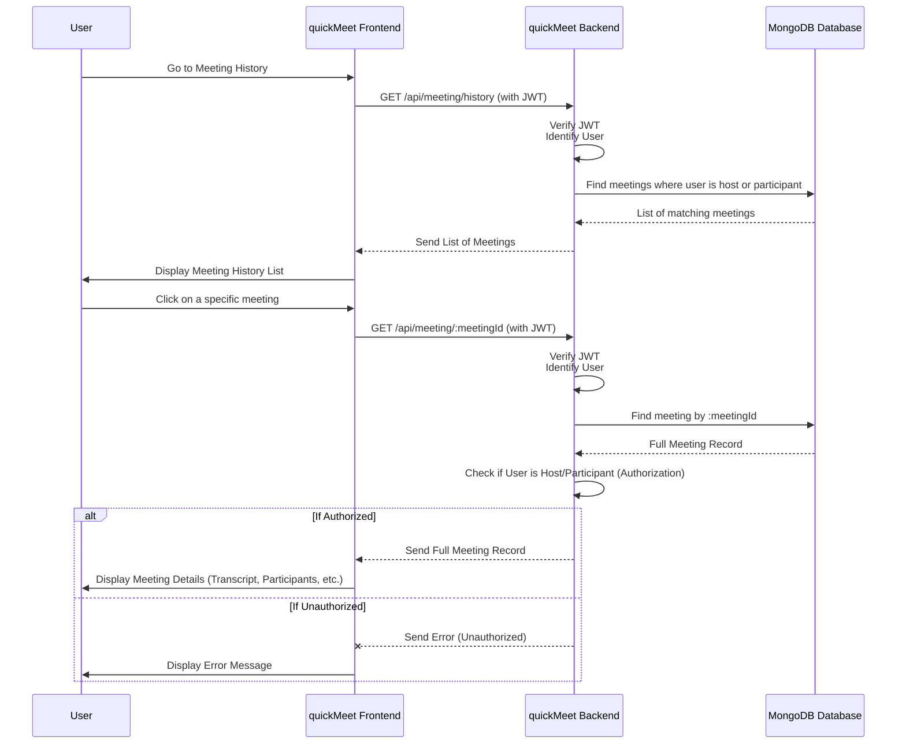

### Looking at the Code

Let's peek at the code to see how quickMeet implements this persistent storage using MongoDB.

**1. Defining the Meeting Structure (Schema)**

Just like defining rules for what goes into a filing cabinet folder, we define a schema for our meeting documents in MongoDB.

*File: `backend/models/schemas/meetingSchema.js`*

```javascript
const mongoose = require('mongoose');
const userSchema = require('./userSchema'); // Import the user schema

// Schema for a single line in the transcript
const transcriptMessageSchema = new mongoose.Schema({
    userId: { type: String, required: true },
    userName: { type: String, required: true },
    text: { type: String, required: true },
    timestamp: { type: Date, default: Date.now } // When the line was spoken/saved
});

// Schema for tracking when participants join/leave
const participantActionSchema = new mongoose.Schema({
    userId: { type: String, required: true },
    displayName: { type: String, required: true },
    email: { type: String, required: true },
    action: { type: String, enum: ['join', 'leave'], required: true }, // 'join' or 'leave'
    timestamp: { type: Date, default: Date.now } // When the action happened
});

// The main Meeting schema
const meetingSchema = new mongoose.Schema({
    meetingId: { type: String, required: true, unique: true }, // Unique ID for the meeting
    host: { type: userSchema, required: true }, // The user who created the meeting
    participants: [{ type: userSchema }], // Array of users who were in the meeting
    transcript: [transcriptMessageSchema], // Array of transcript messages
    participantActions: [participantActionSchema], // Array of join/leave actions
    summary: { type: String, default: '' }, // Optional summary text
    status: { type: String, enum: ['active', 'completed'], default: 'active' }, // Meeting status
    duration: { type: Number, default: 0 } // Meeting duration in seconds (for completed meetings)
},
{
    timestamps: true // Adds 'createdAt' and 'updatedAt' fields automatically
});

module.exports = meetingSchema;
```

This code defines the blueprint for a meeting document in MongoDB. It specifies the types of data (like `String`, `Date`, `Number`), whether they are required, and even includes nested structures for lists of participants, transcript messages, and actions. The `timestamps: true` option is very handy as it automatically adds fields showing when the meeting record was created and last updated.

**2. Database Interaction Functions (Model)**

These functions act as the interface between our backend logic and the MongoDB database. They know how to `create`, `find`, and `update` meeting documents.

*File: `backend/models/meetingModel.js`*

```javascript
const { MeetingModel } = require('../models/schemaLoader'); // Our Mongoose model built from the schema

const createMeeting = async (meetingData) => {
    const meeting = new MeetingModel(meetingData); // Create a new meeting document
    return await meeting.save(); // Save it to the database
};

const findMeetingById = async (id) => {
    // Find a meeting document using its unique 'meetingId' field
    return await MeetingModel.findOne({ meetingId: id });
};

const findAllMeetings = async (userId) => {
    // Find meetings where the user is either the host or a participant
    const query = {
        $or: [
            { 'host.uid': userId }, // Match if user is the host (by Google UID)
            { 'host.email': userId }, // Match by email fallback
            { 'participants': { $elemMatch: { uid: userId } } }, // Match if user is in participants list (by UID)
             { 'participants': { $elemMatch: { email: userId } } } // Match by email fallback
        ]
    };
    // Find documents matching the query and sort by creation date (newest first)
    const meetings = await MeetingModel.find(query).sort({ createdAt: -1 });
    return meetings;
};

const addTranscriptMessage = async (meetingId, messageData) => {
    // Find the meeting and add a new message to the 'transcript' array
    return await MeetingModel.findOneAndUpdate(
        { meetingId }, // Find meeting by ID
        { $push: { transcript: messageData } }, // Add message to transcript array
        { new: true } // Return the updated document
    );
};

// ... (functions for addParticipantAction, updateMeetingSummary, completeMeeting - similar findOneAndUpdate logic) ...

module.exports = {
    createMeeting,
    findMeetingById,
    findAllMeetings,
    addTranscriptMessage,
    // ... other exported functions
};
```

These functions are crucial. `createMeeting` saves a new meeting record when a meeting link is generated. `findMeetingById` retrieves a specific meeting's details. `findAllMeetings` is used for the history page, searching for meetings connected to a specific user ID (obtained from the JWT). Functions like `addTranscriptMessage` show how we can update parts of the saved meeting record (like adding a new line to the transcript) *during* or *after* the meeting.

**3. Backend API Endpoints (Controller)**

These functions handle incoming requests from the frontend, use the model functions to interact with the database, and send responses back. They require the `verifyToken` middleware (from [Chapter 2](02_user_authentication___authorization_.md)) to ensure the user is authenticated.

*File: `backend/controllers/meetingController.js`*

```javascript
// ... imports (createMeeting, findMeetingById, findAllMeetings, etc. from meetingModel)
// ... imports for response handling

const getMeetingLink = async (req, res) => {
    try{
        // ... generate meetingId ...
        const meeting = {
            meetingId: meetingId,
            host: req.user, // Get host info from authenticated user (via verifyToken middleware)
            participants: []
        }
        await createMeeting(meeting); // Use model function to save the new meeting
        // ... send response ...
    }catch(err){ /* ... error handling ... */ }
}

const getMeeting = async (req, res) => {
    try{
        const meetingId = req.params.id;
        const meeting = await findMeetingById(meetingId); // Use model function to find the meeting

        if(!meeting){ /* ... handle not found ... */ }

        // Authorization check: Ensure the authenticated user is the host or a participant
        const wasParticipant = meeting.participants.some(p => p.uid === req.user.uid || p.email === req.user.email);
        const wasHost = meeting.host.uid === req.user.uid || meeting.host.email === req.user.email;

        if (!wasParticipant && !wasHost) {
             // ... handle unauthorized access ...
             return errorResponse(res, 'You do not have permission to view this meeting.', 403); // 403 Forbidden
        }

        // ... send success response with meeting data ...
        return successResponse(res, 'Meeting fetched successfully', meeting);
    }catch(err){ /* ... error handling ... */ }
}

const getMeetingHistory = async (req, res) => {
    try {
        // Get user ID from the authenticated user (via verifyToken middleware)
        const userId = req.user.uid;
        const meetings = await findAllMeetings(userId); // Use model function to get user's meetings

        // ... send success response with list of meetings ...
        return successResponse(res, 'Meeting history fetched successfully', meetings);
    } catch (err) { /* ... error handling ... */ }
}

const saveTranscriptMessage = async (req, res) => {
    try {
        const { meetingId } = req.params;
        const { text } = req.body;
        // User info (userId, userName) is from req.user via verifyToken middleware
        const messageData = { userId: req.user.uid, userName: req.user.displayName, text, timestamp: new Date() };

        const result = await addTranscriptMessage(meetingId, messageData); // Use model function to add transcript line

        if (!result) { /* ... handle not found ... */ }
        // ... send success response ...
        return successResponse(res, 'Transcript message saved', messageData);
    } catch (err) { /* ... error handling ... */ }
}

// ... (other controller functions for summary, end meeting, etc.) ...

module.exports = {
    getMeetingLink,
    getMeeting,
    getMeetingHistory,
    saveTranscriptMessage,
    // ... other exported functions
};
```

Notice how these functions leverage the authenticated user information (`req.user`) provided by the `verifyToken` middleware. `getMeetingHistory` uses `req.user.uid` to query the database for relevant meetings, and `getMeeting` uses `req.user.uid` and `req.user.email` to perform an authorization check *after* fetching the meeting data. `saveTranscriptMessage` uses `req.user` to stamp the transcript message with the speaker's details.

**4. Frontend API Calls**

The frontend uses simple functions to call these backend endpoints, sending the user's JWT for authentication and receiving the data.

*File: `frontend/src/api/meeting.js`*

```javascript
import axios from 'axios';

const API_URL = `${import.meta.env.VITE_APP_API_URL}/meeting`;

export const getMeetingLink = async (token) => {
    // Calls POST /api/meeting/create, sending the token
    const response = await axios.post(`${API_URL}/create`, {}, {
        headers: { Authorization: `Bearer ${token}` }
    });
    return response.data.data; // Returns the new meeting details (including ID)
};

export const getMeeting = async (meetingId, token) => {
    // Calls GET /api/meeting/:meetingId, sending the token
    const response = await axios.get(`${API_URL}/${meetingId}`, {
        headers: { Authorization: `Bearer ${token}` }
    });
    return response.data.data; // Returns the full meeting details
}

export const getMeetingHistory = async (token) => {
    // Calls GET /api/meeting/history, sending the token
    const response = await axios.get(`${API_URL}/history`, {
        headers: { Authorization: `Bearer ${token}` }
    });
    return response.data.data; // Returns a list of meetings
};

export const saveTranscriptMessage = async (meetingId, text, token) => {
    // Calls POST /api/meeting/:meetingId/transcript, sending text and token
    const response = await axios.post(`${API_URL}/${meetingId}/transcript`,
        { text },
        { headers: { Authorization: `Bearer ${token}` } }
    );
    return response.data.data; // Returns confirmation
};

// ... (other API calls for summary, end meeting) ...
```

These `axios` calls show how the frontend communicates with the backend API to trigger the database interactions. Each function that needs to know the user's identity sends the `Authorization: Bearer ${token}` header.

**5. Frontend Components Displaying Data**

The frontend pages (like `MeetingHistory.jsx` and `MeetingDetail.jsx`) use the functions from `api/meeting.js` to fetch the persistent data and then display it to the user.

*File: `frontend/src/pages/MeetingHistory.jsx` (Simplified)*

```jsx
import { useEffect, useMemo, useState } from 'react';
import { useSelector, useDispatch } from 'react-redux';
import { getMeetingHistory } from '../api/meeting'; // Import the API function
import { setMeetingHistory } from '../store/meetingSlice'; // Action to save data in Redux

const MeetingHistory = () => {
  const [isLoading, setIsLoading] = useState(true);
  const user = useSelector(state => state.auth.user); // Get authenticated user and token from Redux
  const meetings = useSelector(state => state.meeting.meetingHistory); // Get meeting history from Redux
  const dispatch = useDispatch();

  useEffect(() => {
    const fetchMeetings = async () => {
      if (!user || !user.token) {
        setIsLoading(false);
        return; // Can't fetch without a user/token
      }
      try {
        setIsLoading(true);
        // Call the backend API using the user's token
        const meetingsData = await getMeetingHistory(user.token);
        // Save the fetched list of meetings in the Redux store
        dispatch(setMeetingHistory(meetingsData));
      } catch (err) {
        console.error('Error fetching meeting history:', err);
        // Handle error
      } finally {
        setIsLoading(false);
      }
    };
    fetchMeetings();
  }, [user, dispatch]); // Re-run effect if user changes

  // ... Filtering and sorting logic (uses the 'meetings' array from Redux)

  return (
    <div>
      <h1>Meeting History</h1>
      {isLoading ? (
        <p>Loading meetings...</p>
      ) : (
        // Display the filtered/sorted meetings list
        <ul>
          {filteredMeetings.map(meeting => (
            <li key={meeting.meetingId}>
              {meeting.meetingId.substring(0, 8)}... - Host: {meeting.host.displayName} - Date: {new Date(meeting.createdAt).toLocaleDateString()}
              {/* Link to Meeting Detail page */}
            </li>
          ))}
        </ul>
      )}
    </div>
  );
};

export default MeetingHistory;
```

*File: `frontend/src/pages/MeetingDetail.jsx` (Simplified)*

```jsx
import { useEffect, useState } from 'react';
import { useParams } from 'react-router-dom';
import { useSelector, useDispatch } from 'react-redux';
import { getMeeting } from '../api/meeting'; // Import the API function
import { setTranscript, setParticipantActions, setMeetingSummary } from '../store/meetingSlice'; // Actions to save data

const MeetingDetail = () => {
  const { meetingId } = useParams(); // Get the meeting ID from the URL
  const [isLoading, setIsLoading] = useState(true);
  const [meeting, setMeeting] = useState(null);
  const user = useSelector(state => state.auth.user); // Get authenticated user and token
  // Get specific data (transcript, actions, summary) from Redux state
  const transcript = useSelector(state => state.meeting.transcript);
  const participantActions = useSelector(state => state.meeting.participantActions);
  const summary = useSelector(state => state.meeting.summary);
  const dispatch = useDispatch();

  useEffect(() => {
    const fetchMeetingDetails = async () => {
      if (!user || !user.token || !meetingId) {
         setIsLoading(false);
         return; // Can't fetch without user/token or meetingId
      }
      try {
        setIsLoading(true);
        // Call the backend API with meetingId and token
        const meetingData = await getMeeting(meetingId, user.token);
        setMeeting(meetingData); // Save main meeting data in local state

        // Save detailed data (transcript, actions, summary) in Redux store
        dispatch(setTranscript(meetingData.transcript || []));
        dispatch(setParticipantActions(meetingData.participantActions || []));
        dispatch(setMeetingSummary(meetingData.summary || ''));

      } catch (err) {
        console.error('Error fetching meeting details:', err);
        // Handle errors (like unauthorized access)
      } finally {
        setIsLoading(false);
      }
    };
    fetchMeetingDetails();

    // Clean up Redux state when leaving the page
    return () => {
      dispatch(setTranscript([]));
      dispatch(setParticipantActions([]));
      dispatch(setMeetingSummary(''));
    };
  }, [meetingId, user, dispatch]); // Re-run effect if meetingId or user changes

  if (isLoading) { return <p>Loading meeting details...</p>; }
  if (!meeting) { return <p>Meeting not found or unauthorized.</p>; }

  return (
    <div>
      <h1>Details for Meeting {meeting.meetingId.substring(0, 8)}...</h1>
      <p>Host: {meeting.host.displayName}</p>
      <p>Status: {meeting.status}</p>

      {/* Tabs to switch between different data views */}
      <div>
        <button>Transcript</button>
        <button>Participants</button>
        <button>Summary</button>
      </div>

      {/* Display data from Redux based on active tab */}
      {/* Example: Displaying transcript */}
      <div>
        <h3>Transcript</h3>
        {transcript.length > 0 ? (
          transcript.map((item, index) => (
            <p key={index}>[{new Date(item.timestamp).toLocaleTimeString()}] {item.userName}: {item.text}</p>
          ))
        ) : <p>No transcript available.</p>}
      </div>

      {/* ... Display Participants and Summary similarly ... */}
    </div>
  );
};

export default MeetingDetail;
```

These frontend components demonstrate how to use the API functions (`getMeetingHistory`, `getMeeting`) to retrieve saved data from the backend, which in turn gets it from the persistent MongoDB database. They then store this data in the Redux state and display it to the user, showing meeting history lists and detailed views including transcript and participant actions.

### Summary

**Persistent Meeting Data** is about keeping a permanent record of each quickMeet meeting. By using **MongoDB** as a database and defining a clear **schema** for meeting documents, quickMeet can save essential information like participants, transcripts, and activity logs. This allows features like viewing **Meeting History** and accessing detailed information about past meetings, long after the live session has ended. The backend uses **Model** functions to interact with the database and **Controller** functions to handle API requests, ensuring that only authenticated and authorized users can access this sensitive data.

Now that we know how to manage meeting data persistently, both during and after the meeting, let's dive into the core of any video conferencing app: sending and receiving live video and audio!

[Next Chapter: WebRTC Media Streaming (Mediasoup)]

---

Show Rendered
# Chapter 4: WebRTC Media Streaming (Mediasoup)

Welcome back to the quickMeet tutorial! In the previous chapters, we built a solid foundation: we learned how [Real-time Meeting Sync](01_real_time_meeting_sync_.md) keeps participants updated instantly, how [User Authentication & Authorization](02_user_authentication___authorization_.md) protects access, and how [Persistent Meeting Data](03_persistent_meeting_data_.md) remembers meeting history.

Now, let's tackle the most visible and arguably most complex part of a video meeting application: sending and receiving live audio and video streams! This is where quickMeet truly comes alive.

### The Problem: Showing Everyone's Face (Efficiently!)

Imagine you're in a meeting with just one other person. Your browser can directly send your video to their browser, and their browser can send their video directly back to yours. This is called **Peer-to-Peer (P2P)** connection using a technology called **WebRTC**. It's efficient for two people because the video data travels directly between you.

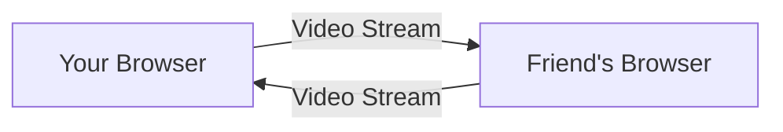

But what happens when a third person joins? Or a fourth? Or twenty?

*   If you send your video *directly* to *everyone* else (still P2P, but "mesh"), your computer has to upload the same video stream multiple times, once for each person. This quickly overwhelms your internet connection and computer resources, especially with high-quality video.
*   Similarly, your computer has to *receive* a separate video stream from *each* other person. With many participants, this also uses a lot of download bandwidth and processing power for decoding all those streams.

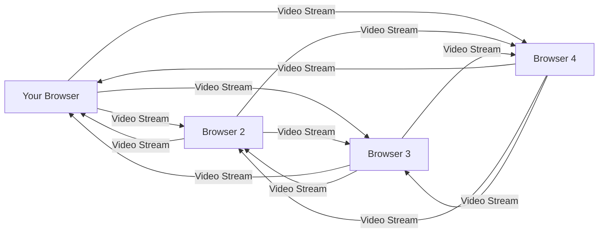
*Problem: Too many arrows! Becomes unmanageable.*

We need a better way to route the media streams, especially in larger meetings.

### The Solution: A Smart Media Router (Mediasoup)

quickMeet solves this scaling problem by using a **Media Server** called **Mediasoup** on the backend. Mediasoup acts as a **Selective Forwarding Unit (SFU)**. Instead of everyone sending video to everyone else, each person sends their video stream *once* to the Mediasoup server. The server then smartly forwards (or *selectively forwards*) copies of that stream to the other participants who need it.

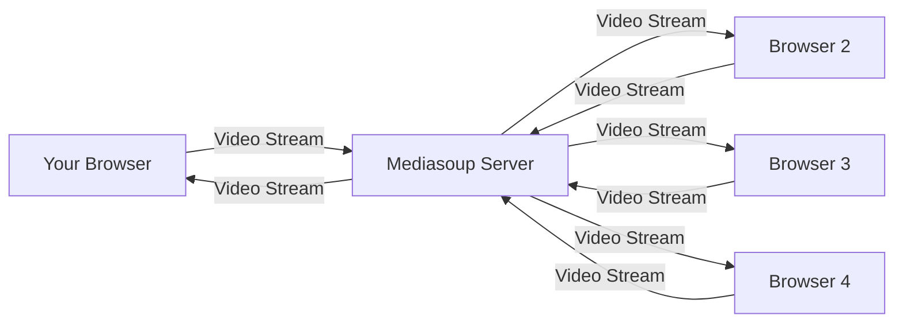

*Benefit: Each browser only sends ONE stream up and receives N-1 streams down, offloading work to the server.*

Mediasoup is powerful because it can:
*   Receive streams from participants (your camera/mic).
*   Forward streams to other participants.
*   Adjust stream quality if needed (though quickMeet keeps it simpler for now).
*   Handle the complex WebRTC negotiation details like connecting (`ICE`), encrypting (`DTLS`), and sending data (`RTP`).

### Key Mediasoup Concepts in quickMeet

To understand how quickMeet uses Mediasoup, let's look at the main pieces involved:

| Concept          | Where it lives (mostly) | What it does                                                                                                | Analogy                                                                |
| :--------------- | :---------------------- | :---------------------------------------------------------------------------------------------------------- | :--------------------------------------------------------------------- |
| **Worker**       | Backend (Mediasoup)     | The main Mediasoup process running on the server. It manages resources like CPU, memory, and network ports. | The power plant that runs the building.                                |
| **Router**       | Backend (Mediasoup)     | Created by a Worker, a Router handles the media for a specific meeting or group of participants. It knows which streams go where within that meeting. | The meeting room where everyone is connected.                          |
| **Transport**    | Both Backend & Frontend | The connection channel between *one browser* and the *Mediasoup Router*. It handles the low-level network stuff (finding paths, encryption). You need one to send media and potentially another to receive. | A dedicated phone line connecting you to the meeting room.             |
| **Producer**     | Both Backend & Frontend | Represents a stream of media (like your video or audio) that your browser is **sending** to the Router via a Send Transport. | You speaking or showing your screen into the phone line.               |
| **Consumer**     | Both Backend & Frontend | Represents a stream of media (like another participant's video or audio) that your browser is **receiving** from the Router via a Receive Transport. | You listening to someone speak or seeing their screen through the line. |
| **RTP Capabilities** | Both Backend & Frontend | Information about what audio/video codecs (formats) and features a browser or the Mediasoup router supports. Used to negotiate compatible ways of sending media. | Everyone agreeing on the language they will speak in the meeting.      |

quickMeet uses the `mediasoup-client` library in the browser (Frontend) to talk to the Mediasoup server library (Backend).

### Use Case Walkthrough: Joining and Seeing Others' Video

Let's trace the simplified steps for a participant joining a meeting and starting to see other people's videos, incorporating the concepts we just learned:

1.  **Frontend (Your Browser): Get Media Permissions:** You click "Join Meeting", and quickMeet asks your browser for permission to access your camera and microphone. Your browser creates local `MediaStream` objects for your video and audio.
2.  **Frontend: Connect to Socket.IO:** Your browser connects to the quickMeet backend via Socket.IO (as in [Chapter 1](01_real_time_meeting_sync_.md)).
3.  **Frontend: Get Server Capabilities:** Your browser asks the backend (via Socket.IO) what the Mediasoup **Router**'s **RTP Capabilities** are.
4.  **Backend (Mediasoup Controller): Send Capabilities:** The backend responds with the Router's capabilities.
5.  **Frontend: Load Mediasoup Device:** Your browser uses the `mediasoup-client` library and the server's capabilities to set up a `Device` object. This object knows how to create **Transports**, **Producers**, and **Consumers** compatible with the server.
6.  **Frontend: Create Send Transport:** Your browser asks the backend (via Socket.IO) to create a **Send Transport** on the server side for you.
7.  **Backend (Mediasoup Controller): Create Send Transport:** The backend tells the Mediasoup **Router** to create a `WebRtcTransport` and sends its connection details (like ICE parameters, DTLS parameters) back to your browser.
8.  **Frontend: Connect Send Transport:** Your browser uses the details from step 7 and its `Device` object to create a client-side **Send Transport**. It then tells this transport to `connect`, which involves the browser and the server doing the ICE and DTLS handshake. Your browser also tells the backend (via Socket.IO) to `connectSendTransport` using its DTLS parameters.
9.  **Frontend: Create Receive Transport:** Your browser repeats steps 6-8, but this time asking the backend to create and connect a **Receive Transport**.
10. **Frontend: Produce Media:** Once the Send Transport is connected, your browser takes your local video (`MediaStreamTrack`) and tells its client-side Send Transport to `produce` that track. It sends the track's **RTP Parameters** to the backend via Socket.IO.
11. **Backend (Mediasoup Controller): Create Producer:** The backend receives your track's parameters and tells the Mediasoup **Router**'s Send Transport to create a **Producer** for your video track. This Producer object on the server now represents your outgoing video stream.
12. **Backend: Notify Others about New Producer:** The backend knows your **Producer** is ready. It publishes a `NEW_PRODUCER` event to Redis (or directly broadcasts via Socket.IO for simplicity in this project's example code), including your `producerId` and `kind` (video/audio). This is the Real-time Sync mechanism from [Chapter 1](01_real_time_meeting_sync_.md).
13. **Frontend (Other Participants' Browsers): Receive NEW_PRODUCER:** Other participants' browsers receive the `NEW_PRODUCER` event via Socket.IO.
14. **Frontend (Other Participants' Browsers): Check Compatibility:** Each other browser uses its `Device` object to check if it `canConsume` this new `producerId` based on its own **RTP Capabilities** and the producer's parameters.
15. **Frontend (Other Participants' Browsers): Consume Media:** If compatible, each other browser asks the backend (via Socket.IO) to `consume` the new producer's stream. They send their own **RTP Capabilities** and the Producer's ID.
16. **Backend (Mediasoup Controller): Create Consumer:** The backend receives the `consume` request and tells the Mediasoup **Router**'s Receive Transport (for that specific participant) to create a **Consumer** for the requested `producerId`. It sends the new Consumer's parameters back to the requesting browser.
17. **Frontend (Other Participants' Browsers): Create Consumer & Get Stream:** Each other browser uses the parameters from step 16 and their `Device` object to create a client-side **Consumer**. This client-side Consumer provides a `MediaStreamTrack`.
18. **Frontend (Other Participants' Browsers): Display Video:** Each other browser creates a `MediaStream` from the track received in step 17 and attaches it to a `<video>` HTML element using `videoElement.srcObject = mediaStream`. The video starts playing, and they see your video!

This entire flow happens for each participant joining and for each media track (video and audio). The Mediasoup server efficiently routes the streams without needing full P2P meshes.

Here's a simplified sequence diagram for one participant joining and one *other* participant receiving their stream:

```mermaid
sequenceDiagram
    participant JoinerFE as Joiner (Frontend)
    participant Backend as quickMeet Backend
    participant Mediasoup as Mediasoup Router
    participant OtherFE as Other User (Frontend)

    JoinerFE->>JoinerFE: Get Camera/Mic Stream
    JoinerFE->>Backend: Socket.emit('getRtpCapabilities')
    Backend->>Mediasoup: Get Router Capabilities
    Mediasoup-->>Backend: Router Capabilities
    Backend-->>JoinerFE: Send Capabilities
    JoinerFE->>JoinerFE: Load mediasoup-client Device
    JoinerFE->>Backend: Socket.emit('createSendTransport')
    Backend->>Mediasoup: Create Send Transport
    Mediasoup-->>Backend: Send Transport Details (ICE, DTLS)
    Backend-->>JoinerFE: Send Transport Details
    JoinerFE->>JoinerFE: Create client Send Transport
    JoinerFE->>Backend: Socket.emit('connectSendTransport', {dtlsParameters})
    Backend->>Mediasoup: Connect Send Transport
    Mediasoup-->>Backend: Connection Success
    Backend-->>JoinerFE: Connection Success
    JoinerFE->>JoinerFE: (Repeat for Recv Transport)
    JoinerFE->>Backend: Socket.emit('produce', {kind, rtpParameters})
    Backend->>Mediasoup: Create Producer on Send Transport
    Mediasoup-->>Backend: Producer ID
    Backend-->>JoinerFE: Send Producer ID
    JoinerFE->>JoinerFE: Store local Producer

    Backend->>OtherFE: Socket.emit('PARTICIPANT_JOINED', {producerId, ...})
    OtherFE->>OtherFE: Handle PARTICIPANT_JOINED
    OtherFE->>OtherFE: Check device.canConsume
    OtherFE->>Backend: Socket.emit('consume', {producerId, rtpCapabilities})
    Backend->>Mediasoup: Create Consumer on Recv Transport
    Mediasoup-->>Backend: Consumer Details (ID, RTP Params)
    Backend-->>OtherFE: Send Consumer Details
    OtherFE->>OtherFE: Create client Consumer
    OtherFE->>OtherFE: Get MediaStreamTrack
    OtherFE->>OtherFE: Create MediaStream
    OtherFE->>OtherFE: Attach stream to &lt;video&gt; element
    OtherFE->>OtherFE: Video starts playing
```

### Looking at the Code

Let's look at simplified snippets demonstrating these steps.

**1. Backend: Initializing Mediasoup Worker and Router**

This happens when the backend application starts.

*File: `backend/controllers/mediasoupController.js`*

```javascript
const mediasoup = require('mediasoup');
const mediasoupConfig = require('../config/mediasoup-config');

let worker, router;

module.exports = async (io) => { // 'io' is the Socket.IO server
  // Create the main worker process
  worker = await mediasoup.createWorker(mediasoupConfig.worker);
  // Create a router within the worker (we'll need one per meeting later)
  // For simplicity in this snippet, it's a single global router.
  router = await worker.createRouter({ mediaCodecs: mediasoupConfig.router.mediaCodecs });

  console.log('Mediasoup worker and router initialized.');

  // Handle Socket.IO connections
  io.on('connection', (socket) => {
    console.log(`User connected: ${socket.id}`);
    // ... rest of the socket handlers ...
  });
};
```

This sets up the core Mediasoup components on the server. In a real multi-meeting app, you'd create a new `router` for each meeting room.

**2. Frontend: Getting Media Permissions**

This uses standard browser WebRTC APIs.

*File: `frontend/src/hooks/useMediasoup.js`*

```javascript
import { useState, useEffect } from "react";
// ... other imports

export const useMediasoup = () => {
  const [videoStream, setVideoStream] = useState(null);
  // ... other state ...

  useEffect(() => {
    const getMediaPermissions = async () => {
      try {
        // Request video and audio stream from the user's devices
        const stream = await navigator.mediaDevices.getUserMedia({
          video: true, // Request video
          audio: true  // Request audio
        });
        setVideoStream(stream); // Store the stream in state
        console.log("Media permissions granted, stream obtained.");
      } catch (error) {
        console.error("Error accessing media devices:", error);
        // Handle permission denied or device issues
      }
    };

    getMediaPermissions();

    return () => {
      // Clean up: Stop tracks when the component unmounts
      if (videoStream) {
        videoStream.getTracks().forEach(track => track.stop());
      }
    };
  }, []); // Run only once on component mount

  // ... rest of the hook logic ...
};
```

This snippet shows how the frontend asks the user for camera and microphone access and stores the resulting `MediaStream`.

**3. Frontend: Getting Server RTP Capabilities and Loading Device**

The client needs to know what the server supports before it can create compatible media components.

*File: `frontend/src/hooks/useMediasoup.js`*

```javascript
// ... imports and state ...

  const getRtpCapabilities = async () => {
    return new Promise((resolve, reject) => {
      // Ask the backend for the router's capabilities
      socket.emit("getRtpCapabilities", (rtpCapabilities) => {
        if (rtpCapabilities.error) {
          reject(rtpCapabilities.error);
        } else {
          resolve(rtpCapabilities);
        }
      });
    });
  };

  const loadDevice = async (rtpCapabilities) => {
    try {
      console.log("Loading mediasoup-client device...");
      const temp_device = new Device();
      // Load the device using the capabilities received from the server
      await temp_device.load({ routerRtpCapabilities: rtpCapabilities });
      setDevice(temp_device); // Store the loaded device
      console.log("Mediasoup device loaded successfully.");
      return temp_device;
    } catch (error) {
      console.error("Error loading device:", error);
      throw error; // Re-throw the error
    }
  };

  useEffect(() => {
    const initDevice = async () => {
        try {
            const rtpCapabilities = await getRtpCapabilities();
            await loadDevice(rtpCapabilities);
        } catch (error) {
            console.error("Failed to initialize device:", error);
        }
    };

    initDevice();

  }, []); // Run only once

  // ... rest of the hook logic ...
```

This code gets the capabilities from the server and then uses the `mediasoup-client` `Device` class to load them. The `Device` is essential for all subsequent media operations.

**4. Backend: Handling `getRtpCapabilities` Socket Event**

The backend simply returns the capabilities of the Mediasoup router.

*File: `backend/controllers/mediasoupController.js`*

```javascript
// ... worker and router initialization ...

io.on('connection', (socket) => {
    console.log(`User connected: ${socket.id}`);

    // ... other socket handlers ...

    socket.on('getRtpCapabilities', (callback) => {
        console.log('Client requested RTP Capabilities.');
        // Return the router's capabilities to the client
        callback(router.rtpCapabilities);
    });

    // ... rest of the socket handlers ...
});
```

This minimal code fulfills the client's request for capabilities.

**5. Frontend: Creating and Connecting Transports**

The client needs to ask the server to create transports first, then connect them.

*File: `frontend/src/hooks/useMediasoup.js`*

```javascript
// ... imports, state, and getRtpCapabilities/loadDevice ...

  const createSendTransport = async () => {
    if (!device) { console.error("Device not initialized"); return; }

    return new Promise((resolve, reject) => {
      // Ask the backend to create a server-side Send Transport
      socket.emit("createSendTransport", (response) => {
        if (response.error) { reject(response.error); }
        else {
          console.log("Send Transport details received:", response.id);
          // Create the client-side Send Transport using details from backend
          const transport = device.createSendTransport({
            id: response.id,
            iceParameters: response.iceParameters,
            iceCandidates: response.iceCandidates,
            dtlsParameters: response.dtlsParameters,
          });

          // Listen for the client-side 'connect' event
          transport.on("connect", ({ dtlsParameters }, callback, errback) => {
            console.log("Send Transport 'connect' event, sending DTLS params to backend...");
            // Tell the backend to connect the server-side transport
            socket.emit("connectSendTransport", { dtlsParameters }, (response) => {
              if (response.error) { errback(response.error); }
              else { console.log("Backend confirmed Send Transport connect."); callback(); }
            });
          });
          // Other transport event listeners (like 'produce') are set here too

          resolve(transport); // Return the created client-side transport
        }
      });
    });
  };

  const createRecvTransport = async () => {
     // Similar logic as createSendTransport, but emits 'createRecvTransport' and 'connectRecvTransport'
     // ... (code omitted for brevity, see full source) ...
  };

  // Use useEffect to call these once the device is ready
  useEffect(() => {
    const initializeTransports = async () => {
      if (device) {
        try {
          console.log("Initializing transports...");
          const sendTransport = await createSendTransport();
          const recvTransport = await createRecvTransport();
          setSendTransport(sendTransport);
          setRecvTransport(recvTransport);
          console.log("Send and Receive transports initialized.");
        } catch (error) {
          console.error("Error initializing transports:", error);
        }
      }
    };
    initializeTransports();
  }, [device]); // Run this effect when 'device' state changes (becomes available)

  // ... rest of the hook logic ...
```

This is a key part of the WebRTC dance. The client needs parameters from the server to create its local transports, and then they perform a handshake (`connect` event) to establish the peer connection.

**6. Backend: Handling `createSendTransport` and `connectSendTransport`**

The backend acts as an intermediary, telling Mediasoup to create the transport and then connecting it when the client's DTLS parameters arrive.

*File: `backend/controllers/mediasoupController.js`*

```javascript
// ... worker, router, and other socket handlers ...

    async function createTransport(callback) {
      try {
        console.log("Creating WebRTC transport on backend...");
        // Tell the router to create a WebRTC transport
        const transport = await router.createWebRtcTransport({
          listenIps: [{ ip: "127.0.0.1", announcedIp: null }], // Server IP
          enableUdp: true,
          enableTcp: true,
          preferUdp: true,
          // ... bitrate options ...
        });

        // Send transport details back to the client
        callback({
          id: transport.id,
          iceParameters: transport.iceParameters,
          iceCandidates: transport.iceCandidates,
          dtlsParameters: transport.dtlsParameters,
        });
        console.log(`Backend Transport created with ID: ${transport.id}`);
        return transport; // Return the server-side transport object
      } catch (error) {
        console.error('Error creating transport:', error);
        callback({ error: error.message });
        throw error;
      }
    }

    socket.on("createSendTransport", async (callback) => {
      try {
        // Store the server-side transport object on the socket for later use
        socket.SendTransport = await createTransport(callback);
      } catch (error) {
        console.error("🚨 Error creating SendTransport:", error);
        callback({ error: "Failed to create transport" });
      }
    });

    socket.on("createRecvTransport", async (callback) => {
       // Similar logic as createSendTransport, calls createTransport
       // ... (code omitted for brevity) ...
    });

    async function connectTransport(callback, transport, dtlsParameters) {
      if (transport) {
        console.log(`Connecting transport ${transport.id} with DTLS parameters...`);
        // Tell the server-side transport to connect using client's DTLS parameters
        await transport.connect({ dtlsParameters });
        callback({ success: true, transportId: transport.id });
        console.log(`Transport connected: ${transport.id}`);
      } else {
        callback({ error: 'Transport not found' });
      }
    }

    socket.on('connectSendTransport', async ({ dtlsParameters }, callback) => {
      try {
        // Use the stored server-side SendTransport object
        await connectTransport(callback, socket.SendTransport, dtlsParameters);
      } catch (error) {
        console.error("Error connecting SendTransport:", error);
        callback({ error: error.message });
      }
    });

    socket.on('connectRecvTransport', async ({ dtlsParameters }, callback) => {
       // Similar logic as connectSendTransport, uses socket.RecvTransport
       // ... (code omitted for brevity) ...
    });

    // ... rest of the socket handlers ...
```

The backend uses the `router.createWebRtcTransport` method and then the transport's `connect` method based on messages from the frontend. Storing the transport object on the `socket` object (`socket.SendTransport`, `socket.RecvTransport`) is a common pattern to link the transport to the specific user's connection.

**7. Frontend: Producing Media**

Once the Send Transport is connected, the client can start sending its video/audio tracks.

*File: `frontend/src/hooks/useMediasoup.js`*

```javascript
// ... imports, state, transports ...

  const produceMedia = async (track) => {
    if (!sendTransport) {
      console.error("Send transport not initialized");
      return null;
    }
    if (!track || track.readyState === 'ended') {
       console.error("Invalid or ended track provided for producing");
       return null;
    }

    try {
      console.log(`Attempting to produce ${track.kind} media...`);
      // Use the client-side Send Transport to create a Producer
      const producer = await sendTransport.produce({
        track, // The MediaStreamTrack (video or audio)
        // Add encoding options here for quality control
        encodings: [ { maxBitrate: 900000 } ],
        // Add codec options here
        codecOptions: { videoGoogleStartBitrate: 1000 },
      });

      console.log(`Producer created successfully: ${producer.id}`);
      // Store the producer object
      setProducer(producer); // Assuming we only produce one video/audio stream

      return producer;
    } catch (error) {
      console.error("Error producing media:", error);
      return null;
    }
  };

  // Example: Call produceMedia after transports are ready and stream is available
  useEffect(() => {
      const startProducing = async () => {
          if (sendTransport && videoStream && !producer) { // Check if not already producing
              const videoTrack = videoStream.getVideoTracks()[0];
              if (videoTrack) {
                  await produceMedia(videoTrack); // Produce video
                  // You would also produce the audio track here
              }
          }
      };
      startProducing();
  }, [sendTransport, videoStream, producer]); // Rerun if these dependencies change

// ... rest of the hook logic ...
```

The `sendTransport.produce` method is crucial. It negotiates with the server using the track's capabilities and creates both a client-side and server-side `Producer`. The server-side `producerId` is returned and is key for other participants to consume this stream.

**8. Backend: Handling `produce` Socket Event and Notifying Others**

The backend receives the production request, creates the server-side Producer, and then tells everyone else about it.

*File: `backend/controllers/mediasoupController.js`*

```javascript
// ... worker, router, transports, and other socket handlers ...

    socket.on("produce", async ({ kind, rtpParameters }, callback) => {
      try {
        if (!socket.SendTransport) {
          console.error("🚨 SendTransport not found for produce request!");
          return callback({ error: "SendTransport not initialized" });
        }

        console.log(`Creating producer (${kind}) on server...`);
        // Tell the server-side Send Transport to create a Producer
        const producer = await socket.SendTransport.produce({
          kind, // 'video' or 'audio'
          rtpParameters, // Parameters from the client's track
        });

        // Store the producer object (e.g., in a Map indexed by producer.id)
        // This allows other consumers to find it later
        producers.set(producer.id, producer); // Example using a global Map
        console.log(`✅ Producer created with ID: ${producer.id}`);

        // Send the new Producer's ID back to the client that just produced
        callback({ id: producer.id });

        // NOW, tell everyone else about this new producer!
        // This uses the real-time sync mechanism (Chapter 1).
        await publishEvent("NEW_PRODUCER", {
          producerId: producer.id,
          socketId: socket.id, // Optional: identify the user by socket
          kind, // 'video' or 'audio'
          // Add other relevant info like user ID, display name etc.
        });

      } catch (error) {
        console.error("🚨 Error producing media on backend:", error);
        callback({ error: "Failed to produce media: " + error.message });
      }
    });

// ... rest of the socket handlers ...
```

After creating the `Producer` on the Mediasoup router, the backend immediately uses `publishEvent` (from [Chapter 1](01_real_time_meeting_sync_.md)) to broadcast this information. This is how other participants learn that a new stream is available.

**9. Frontend: Receiving `NEW_PRODUCER` and Consuming Media**

Other clients receive the `NEW_PRODUCER` event and decide if/how to consume it.

*File: `frontend/src/hooks/useMediasoup.js`*

```javascript
// ... imports, state, transports, producer ...

  const consumeMedia = async (producerId) => {
    if (!recvTransport) {
      console.error("Receive transport not initialized");
      return null;
    }
    if (!device || !device.loaded) {
       console.error("Mediasoup device not loaded for consuming");
       return null;
    }

    // Check if we can consume this producer based on capabilities
    // Note: Mediasoup client documentation suggests device.canConsume(producerId, rtpCapabilities)
    // but sometimes simple rtpCapabilities check is used depending on version.
    // The server also verifies this.
    // Simplified check for illustration:
    if (!device.rtpCapabilities || !producerId) {
        console.warn("Missing capabilities or producerId for consumption check.");
        // Proceeding anyway, server will validate.
    }

    try {
      console.log(`Attempting to consume media for producer: ${producerId}`);

      // Ask the backend to create a server-side Consumer
      const stream = await new Promise((resolve, reject) => {
         socket.emit("consume", {
           producerId, // The ID of the producer we want to consume
           rtpCapabilities: device.rtpCapabilities, // Our capabilities
         }, async (response) => {
           if (response.error) { reject(response.error); }
           else {
             console.log("Consumer details received:", response.id);
             try {
               // Create the client-side Consumer using details from backend
               const consumer = await recvTransport.consume({
                 id: response.id,
                 producerId: response.producerId,
                 kind: response.kind,
                 rtpParameters: response.rtpParameters,
                 paused: response.producerPaused, // Initial state from server
               });

               // Store the consumer object
               setConsumers(prev => [...prev, consumer]);

               // Consumer provides a MediaStreamTrack!
               const stream = new MediaStream([consumer.track]);
               console.log(`Consumer created, got stream with ${stream.getTracks().length} track(s).`);

               // Mediasoup consumers are often paused initially, resume them to start receiving data
               await consumer.resume();
               console.log(`Consumer ${consumer.id} resumed.`);

               resolve(stream); // Return the MediaStream
             } catch (err) {
               console.error("Error creating client-side consumer:", err);
               reject(err);
             }
           }
         });
      });
      return stream; // Return the resulting stream
    } catch (err) {
      console.error("Error in consumeMedia:", err);
      return null;
    }
  };


  // Listener for NEW_PRODUCER events (comes from the server via Socket.IO/Redis)
  socket.on("NEW_PRODUCER", async (payload) => {
    console.log("Received NEW_PRODUCER event:", payload);

    // Check if this is our own producer (we don't consume our own)
    if (producer && producer.id === payload.producerId) {
      console.log("Received our own producer event, skipping consumption.");
      return;
    }

    // Check if we are already consuming this producer
    const alreadyConsuming = consumers.some(c => c.producerId === payload.producerId);
    if (alreadyConsuming) {
        console.log(`Already consuming producer ${payload.producerId}, skipping.`);
        return;
    }

    // Check if receive transport is ready
    if (!recvTransport || !device || !device.loaded) {
       console.warn("Receive transport or device not ready, cannot consume yet.");
       // You might need to queue this for later consumption if transports aren't ready
       return;
    }

    // Attempt to consume the media
    const stream = await consumeMedia(payload.producerId);

    if (stream) {
        console.log(`Successfully consumed stream for producer ${payload.producerId}`);
        // Add the consumed stream to our list of participant streams
        setParticipantStreams(prevStreams => {
          // Find associated participant from Redux state if possible
          const participant = meeting?.participants?.find(p => p.producerId === payload.producerId);
          return [...prevStreams, {
            producerId: payload.producerId,
            stream,
            email: participant?.email || 'unknown', // Get user info if available
            displayName: participant?.displayName || 'Unknown Participant'
          }];
        });
    } else {
        console.error(`Failed to consume stream for producer ${payload.producerId}`);
        // Handle the failure (e.g., show a placeholder)
    }
  });

// ... rest of the hook logic ...
```

This is the receiving side. When a `NEW_PRODUCER` event is detected, the client requests to `consume` it. If successful, it gets a `MediaStream` which it can then use. The `setParticipantStreams` state update is critical because that state is used by the `VideoGrid` component to display the videos.

**10. Backend: Handling `consume` Socket Event**

The backend validates the request and tells Mediasoup to create the server-side Consumer.

*File: `backend/controllers/mediasoupController.js`*

```javascript
// ... worker, router, producers Map, other socket handlers ...

    socket.on('consume', async ({ producerId, rtpCapabilities }, callback) => {
      try {
        // Basic validation
        if (!socket.RecvTransport) {
          console.error('🚨 No receive transport for socket:', socket.id);
          return callback({ error: 'Receive transport not initialized' });
        }
        if (!producers.has(producerId)) {
           console.error(`🚨 Producer not found with ID: ${producerId}`);
           return callback({ error: 'Producer not found' });
        }
        const producer = producers.get(producerId); // Get the server-side Producer object

        // Check if the router can consume this producer with the client's capabilities
        if (!router.canConsume({ producerId, rtpCapabilities })) {
          console.error('🚨 Router cannot consume media:', { producerId, rtpCapabilities });
          return callback({ error: 'Cannot consume media - incompatible parameters' });
        }

        console.log(`✅ Creating consumer for producer: ${producerId}`);
        // Tell the server-side Receive Transport to create a Consumer
        const consumer = await socket.RecvTransport.consume({
          producerId,      // The ID of the producer we are consuming
          rtpCapabilities, // Client's capabilities
          paused: producer.kind === 'video' // Start video paused initially for better UX? Or false to start active. Let's use false for active.
        });

        // Store the consumer object
        consumers.set(consumer.id, consumer); // Example using a global Map
        console.log(`✅ Consumer created with ID: ${consumer.id}`);

        // Send consumer parameters back to client
        callback({
          id: consumer.id,
          producerId,
          kind: consumer.kind,
          rtpParameters: consumer.rtpParameters,
          producerPaused: consumer.producerPaused, // State of the source producer
          paused: consumer.paused, // State of this specific consumer
        });

        // Add event listeners for the server-side consumer
        consumer.on('producerclose', () => {
          console.log(`⚠️ Producer closed for consumer ${consumer.id}`);
          // Clean up this consumer if the source producer stops
          consumer.close();
          consumers.delete(consumer.id);
        });
        // ... other consumer event listeners ...

      } catch (error) {
        console.error('🚨 Error in consume handler:', error);
        callback({ error: 'Internal server error while consuming media' });
      }
    });

// ... rest of the socket handlers ...
```

This backend logic connects a participant's `RecvTransport` to another participant's `Producer`, creating the path for media data to flow through the Mediasoup router. The parameters returned to the client allow it to create its local `Consumer` representation.

**11. Frontend: Displaying Streams in the Video Grid**

The `VideoGrid` component receives the `participantStreams` state (which now includes the `MediaStream` objects) and renders `<video>` elements.

*File: `frontend/src/components/VideoGrid.jsx` (Simplified)*

```jsx
import React, { useRef, useEffect, useState } from 'react';
// ... other imports

const ParticipantVideo = React.memo(({ stream, isCurrentUser, displayName, isPlaceholder }) => {
  const videoRef = useRef(null);
  const isPlayingRef = useRef(false);

  useEffect(() => {
    const setupVideo = async () => {
      // If we have a stream and a video element...
      if (videoRef.current && stream) {
        console.log(`Setting up video for ${displayName || 'participant'}`);
        // Attach the MediaStream to the video element's srcObject
        videoRef.current.srcObject = stream;

        // Mute local audio to prevent echo
        videoRef.current.muted = isCurrentUser;

        // Attempt to play the video with retry logic
        // (Full retry logic omitted for brevity, see source)
        try {
            await videoRef.current.play();
            isPlayingRef.current = true;
            console.log(`Video playing for ${displayName || 'participant'}`);
        } catch (err) {
            console.error(`Error playing video for ${displayName || 'participant'}:`, err);
            isPlayingRef.current = false;
        }
      } else if (videoRef.current) {
         // If no stream, ensure no srcObject is set
         videoRef.current.srcObject = null;
         isPlayingRef.current = false;
      }
    };
    setupVideo();

    // Clean up function: remove stream when component unmounts or stream changes
    return () => {
      if (videoRef.current && videoRef.current.srcObject) {
         videoRef.current.srcObject = null;
      }
    };
  }, [stream, isCurrentUser, displayName, isPlaceholder]); // Re-run effect if stream changes

  // Render logic: show video or placeholder/avatar
  return (
    <div className="relative h-full rounded-lg overflow-hidden">
      {stream && !isPlaceholder ? (
        <video ref={videoRef} autoPlay playsInline muted={isCurrentUser} className="w-full h-full object-cover" />
      ) : (
        // Show avatar or placeholder if no stream
        <div className="w-full h-full flex items-center justify-center bg-gray-700 text-white">
           {displayName?.charAt(0)?.toUpperCase() || '?'}
        </div>
      )}
       {/* Participant name overlay */}
       <div className="absolute bottom-2 left-2 bg-black bg-opacity-50 text-white text-xs px-2 py-1 rounded-md">
            {displayName}{isCurrentUser ? " (You)" : ""}
        </div>
    </div>
  );
});


const VideoGrid = React.memo(({ participantStreams = [], localStream, videoEnabled = true }) => {
  // ... pagination logic ...

  // Combine local stream and participant streams for display
  const allStreams = useMemo(() => {
      const streams = [...participantStreams];
      if (localStream) {
          // Add local stream as if it's another participant for grid layout
          streams.unshift({ stream: localStream, isCurrentUser: true, email: 'local', displayName: 'You', producerId: 'local-producer-id' });
      }
      return streams;
  }, [participantStreams, localStream]); // Recompute if these change

  // Select participants for the current page (simplified: show all if no pagination)
  const streamsToShow = allStreams; // In this simple view, show all

  // Calculate grid columns/rows based on count (simplified)
   const gridClass = streamsToShow.length > 1 ? 'grid-cols-2 grid-rows-2' : 'grid-cols-1 grid-rows-1';

  return (
    <div className="h-full w-full">
      <div className={`grid ${gridClass} gap-2 h-full`}>
        {/* Map through the streams and render ParticipantVideo for each */}
        {streamsToShow.map((participant) => (
          <ParticipantVideo
            key={participant.producerId || participant.email || 'placeholder'} // Use a unique key
            stream={participant.stream}
            isCurrentUser={participant.isCurrentUser || false}
            displayName={participant.displayName}
            isPlaceholder={participant.isPlaceholder || false}
            // Pass videoEnabled status down
            videoEnabled={participant.isCurrentUser ? videoEnabled : true} // Assume remote video is always desired if available
          />
        ))}
      </div>
       {/* ... Pagination controls if needed ... */}
    </div>
  );
},
// Custom comparison function to optimize re-renders (omitted for brevity)
);

export default VideoGrid;
```

The `VideoGrid` component receives the `participantStreams` list (which contains the `MediaStream` objects obtained from consuming). It maps over this list, rendering a `ParticipantVideo` component for each. The `ParticipantVideo` component then uses a `useRef` to get a reference to the `<video>` element and sets its `srcObject` to the `MediaStream`. This is the final step that makes the video appear on the screen!

### Summary

WebRTC is the browser technology for real-time communication, but for scalable video conferencing, a server-side Media Server like Mediasoup is essential. Mediasoup acts as an SFU, routing streams efficiently.

In quickMeet, the **Frontend** uses `mediasoup-client` to:
*   Get local media (`getUserMedia`).
*   Negotiate capabilities with the server (`getRtpCapabilities`).
*   Set up **Transports** (`createSendTransport`, `createRecvTransport`).
*   **Produce** local streams (`sendTransport.produce`).
*   **Consume** remote streams (`recvTransport.consume`) after being notified by the backend (`NEW_PRODUCER` event).
*   Attach resulting **MediaStreams** to `<video>` elements for display.

The **Backend** uses the `mediasoup` library to:
*   Initialize a **Worker** and **Router**.
*   Handle client requests to create server-side **Transports**.
*   Receive and create server-side **Producers** for incoming streams.
*   Create server-side **Consumers** for clients requesting streams.
*   Route the media data through the Router between Producers and Consumers.
*   Notify clients about new Producers via the real-time sync layer (like Socket.IO/Redis from [Chapter 1](01_real_time_meeting_sync_.md)).

Together, WebRTC and Mediasoup handle the complex task of getting live video and audio flowing between everyone in the meeting!

Now that we've seen how the media streams are managed, let's look at how the frontend keeps track of all the participants, their streams, and other meeting information in an organized way.

[Next Chapter: Frontend State Management (Redux)]

---

Show Rendered
# Chapter 5: Frontend State Management (Redux)

Welcome back! In our last chapter, [WebRTC Media Streaming (Mediasoup)](04_webrtc_media_streaming__mediasoup__.md), we dived into the complex world of getting video and audio streams flowing between participants using Mediasoup. You saw how events like `NEW_PRODUCER` arrive on the frontend, telling us about new streams.

Now, think about everything happening in the frontend application at once:
*   Who is the currently logged-in user?
*   What meeting am I in? What's its ID?
*   Who else is in this meeting? Are they sending video? Audio?
*   What are the recent chat messages?
*   Has the transcription started? What's the latest transcript line?
*   Are we waiting for a response from the server?

All this information makes up the **state** of our application *on the frontend*. Many different parts of the application need access to this state. For example, the video grid needs the list of participants and their streams, the chat box needs the messages, the meeting header needs the meeting ID, and buttons might need to know if the user is logged in.

### The Problem: Keeping Everyone on the Same Page

As a frontend application grows, managing this state becomes tricky.

*   **Passing data down:** You could pass data from parent components to child components through "props". But what if a component deep down in the hierarchy needs data from high up, or needs to update data that affects a component elsewhere? You end up "prop drilling" – passing props through many layers, making your code hard to understand and maintain.
*   **Updating data:** How does a component update data that other components rely on? You might use callbacks, but this also gets complicated quickly, creating tangled webs of dependencies.
*   **Consistency:** If the same piece of data (like the list of participants) is stored in multiple places, how do you ensure they are always in sync?

Without a clear strategy, the frontend state can become chaotic, leading to bugs where different parts of the UI show inconsistent information.

### The Solution: A Single Source of Truth (Redux)

This is where **Frontend State Management** libraries like Redux come in. Redux provides a central "store" for all your application's state. Think of it like a **central library** where all important information is kept, organized, and accessible to anyone who needs it.

Here's the core idea behind Redux:

*   **Single Source of Truth:** All your application's state is stored in one JavaScript object within the Redux store.
*   **State is Read-Only:** You cannot directly change the state object.
*   **Changes are Predictable:** The *only* way to change the state is by dispatching an **Action** (an object describing *what happened*). These actions are processed by pure functions called **Reducers**, which take the current state and the action and return a *new* state object.

This approach makes it much easier to understand *when*, *why*, and *how* your application's state changes. It makes debugging simpler and helps ensure consistency across your UI.

### Key Redux Concepts in quickMeet

quickMeet uses Redux (specifically with `@reduxjs/toolkit`, which simplifies Redux development) to manage its frontend state. Let's break down the key players:

| Concept      | What it is                                                         | Analogy                                                                 |
| :----------- | :----------------------------------------------------------------- | :---------------------------------------------------------------------- |
| **Store**    | The single JavaScript object holding the entire application state. | The Central Library itself.                                             |
| **State**    | The data currently stored in the Store.                          | All the books and information *inside* the library right now.           |
| **Action**   | A plain JavaScript object describing *what happened*.              | A note saying "A new book arrived" or "Someone borrowed a specific book". |
| **Reducer**  | A function that takes the current state and an action, and returns a *new* state. It's the *only* way state changes. | The librarian who knows how to add a new book, check out a book, etc., based on the notes (actions). They don't change the existing books, they get new shelves if needed. |
| **Dispatch** | The method used to send an Action to the Store.                    | Handing your note ("action") to the front desk of the library.          |
| **Selector** | A function or hook used by components to read data from the State. | You asking the librarian (or looking up in the catalog) for specific information or a book. |

### Use Case Walkthrough: A Participant Joins (Redux Edition)

Let's revisit the use case from [Chapter 1](01_real_time_meeting_sync_.md) and [Chapter 4](04_webrtc_media_streaming__mediasoup__.md) – a participant joins a meeting. How does Redux help manage the state change on the frontend?

1.  **New Participant Joins:** The backend detects a new participant and broadcasts a `PARTICIPANT_JOINED` event via Socket.IO (as seen in [Chapter 1](01_real_time_meeting_sync_.md)).
2.  **Frontend Socket Listener:** Your quickMeet frontend, specifically the Socket.IO listener in `useMediasoup.js`, receives this `PARTICIPANT_JOINED` event (as seen in [Chapter 4](04_webrtc_media_streaming__mediasoup__.md)). The payload contains the new participant's details.
3.  **Dispatch an Action:** Instead of directly manipulating a list of participants, the frontend code creates a Redux **Action** describing this event (e.g., `updateMeetingParticipants` action with the new participant's data as the payload) and **Dispatches** it to the Redux **Store**.
4.  **Store Receives Action:** The Redux Store receives the dispatched action.
5.  **Reducer Handles Action:** The Store finds the relevant **Reducer** function (part of the `meetingSlice` in quickMeet) that knows how to handle `updateMeetingParticipants` actions. The reducer receives the *current* `meeting` state from the Store and the action's payload (the new participant's data).
6.  **Reducer Calculates New State:** The reducer calculates the *new* state for the `meeting` slice. It takes the existing list of participants and adds the new participant to it, returning a *new* state object for the meeting.
7.  **Store Updates State:** The Redux Store replaces the old `meeting` state with the new state returned by the reducer.
8.  **Components Update:** Any frontend component (like the `VideoGrid` component) that is using a **Selector** to read the list of participants from the Redux Store (`useSelector(state => state.meeting.meeting.participants)`) automatically detects that the state it's interested in has changed. React (thanks to the `react-redux` library) triggers a re-render of these components.
9.  **UI Shows New Participant:** The `VideoGrid` re-renders with the updated list of participants, now including the new person, displaying their avatar or video feed (once consumed, as in [Chapter 4](04_webrtc_media_streaming__mediasoup__.md)).

This flow ensures that the participant list is only stored in one place (the Redux store), and any change to it goes through the same predictable process (Dispatch Action -> Reducer -> New State).

Here is a simplified sequence diagram of this flow:

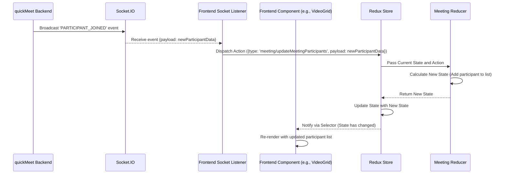

### Looking at the Code

Let's peek at the quickMeet code to see how Redux is implemented.

**1. Setting up the Redux Store (`frontend/src/store/index.js`)**

This file is the entry point for creating the Redux store. It uses `configureStore` from `@reduxjs/toolkit` and combines different "slices" of our application state.

```javascript
// --- frontend/src/store/index.js ---
import { configureStore } from "@reduxjs/toolkit";
import authReducer from "./authSlice"; // Reducer for authentication state
import meetingReducer from "./meetingSlice"; // Reducer for meeting-specific state

const store = configureStore({
  reducer: {
    auth: authReducer, // 'auth' slice of the state
    meeting: meetingReducer, // 'meeting' slice of the state
  },
});

export default store;
```

This code sets up the main store. We can see that the total application state will have two main parts: `auth` (managed by `authReducer`) and `meeting` (managed by `meetingReducer`).

**2. Defining a State Slice (`frontend/src/store/meetingSlice.js`)**

A "slice" in `@reduxjs/toolkit` is a convenient way to define a piece of the Redux state, including its initial value, actions, and reducers, all in one place.

```javascript
// --- frontend/src/store/meetingSlice.js (Simplified) ---
import { createSlice } from "@reduxjs/toolkit";

const initialState = {
  meeting: null, // Holds details of the current active meeting
  meetingHistory: [], // List of past meetings
  transcript: [], // Current meeting transcript
  participantActions: [], // Join/leave logs
  summary: "" // Meeting summary
};

const meetingSlice = createSlice({
  name: "meeting", // Name of this slice (used in action types, like 'meeting/updateMeetingParticipants')
  initialState,
  reducers: {
    // Define reducers here. Each reducer corresponds to an action.
    // This reducer handles adding/updating a participant in the current meeting state.
    updateMeetingParticipants: (state, action) => {
      console.log("Adding/Updating participant in Redux:", action.payload);

      if (!state.meeting || !state.meeting.participants) {
        console.error("Meeting or participants list not initialized!");
        return; // Cannot update if meeting state is not ready
      }

      const participantData = action.payload;

      // Check if participant already exists based on email or producerId
      const existingIndex = state.meeting.participants.findIndex(
        participant => (
          (participant.email === participantData.email) ||
          (participantData.producerId && participant.producerId === participantData.producerId)
        )
      );

      // Redux Toolkit uses Immer internally, allowing "mutable" updates.
      // This looks like direct mutation, but Immer creates an immutable copy behind the scenes.
      if (existingIndex >= 0) {
        console.log(`Participant ${participantData.email} already exists, updating.`);
        // Update existing participant data if needed
        const existingParticipant = state.meeting.participants[existingIndex];
        if (participantData.producerId) existingParticipant.producerId = participantData.producerId;
        if (participantData.displayName) existingParticipant.displayName = participantData.displayName;
        if (participantData.photoURL) existingParticipant.photoURL = participantData.photoURL;

      } else {
        console.log(`Adding new participant ${participantData.email}.`);
        // Add the new participant to the array
        state.meeting.participants.push(participantData);
      }

      // Note: Storing to localStorage here is a side effect within the reducer.
      // While done in this project for simplicity, best practice is to handle
      // side effects (like localStorage, API calls) outside of reducers,
      // typically using middleware or in the action dispatching code.
      localStorage.setItem('meeting', JSON.stringify(state.meeting));
    },

    // Other reducers for different actions...
    // setMeetingId: (state, action) => { ... }
    // removeMeetingParticipant: (state, action) => { ... }
    // addTranscriptMessage: (state, action) => { ... }
    // ... etc.
  },
});

// Actions are automatically generated by createSlice
export const { updateMeetingParticipants /*, other actions */ } = meetingSlice.actions;

// The reducer function is also exported
export default meetingSlice.reducer;
```

This slice defines the structure of the `meeting` state and how it changes. The `updateMeetingParticipants` reducer is where the logic for adding or updating a participant lives. Notice how Redux Toolkit allows you to write seemingly "mutating" code (`state.meeting.participants.push(...)` or `existingParticipant.producerId = ...`), but it's actually using a library called Immer to safely produce a new, immutable state behind the scenes.

**3. Dispatching an Action from a Component/Hook (`frontend/src/hooks/useMediasoup.js`)**

When the frontend receives an event that should change the state, it uses the `useDispatch` hook to get the `dispatch` function and then calls `dispatch` with the appropriate action.

```javascript
// --- frontend/src/hooks/useMediasoup.js (Simplified) ---
import { useState, useEffect } from "react";
// ... other imports ...
import { useDispatch, useSelector } from 'react-redux'; // Import Redux hooks
import {
    updateMeetingParticipants, // Import the action creator
    removeMeetingParticipant, // Import other actions
} from '../store/meetingSlice';

// ... socket setup ...

export const useMediasoup = () => {
  // ... state and other hooks ...
  const dispatch = useDispatch(); // Get the dispatch function

  // ... other socket listeners ...

  // Listener for NEW_PRODUCER events (which often implies a participant is now streaming)
  // This listener is simplified for Redux focus
  socket.on("NEW_PRODUCER", async (payload) => {
    console.log("Received NEW_PRODUCER event:", payload);

    // We need the participant's actual info (name, email etc.) to add to the list.
    // In a real app, you might get this from a separate participant list update,
    // or the NEW_PRODUCER event payload might include more user details.
    // For this example, let's assume payload has enough to identify or retrieve participant info.
    // The quickMeet code does this slightly differently by updating meeting participants
    // based on PARTICIPANT_JOINED event and correlating with producers later.
    // Let's simulate dispatching an update based on producer data:

    const participantData = {
        producerId: payload.producerId,
        email: payload.email || 'unknown@example.com', // Assuming email might be in payload
        displayName: payload.displayName || 'New Participant', // Assuming name might be in payload
        kind: payload.kind // 'video' or 'audio'
        // Add other relevant participant info you have
    };

    // Dispatch the action to update the meeting participants state in Redux
    dispatch(updateMeetingParticipants(participantData));

    // The consumption logic to actually display the stream follows (as seen in Ch 4)
    // ... consumeMedia(payload.producerId) ...
  });

  // Listener for PARTICIPANT_LEFT event
  socket.on("PARTICIPANT_LEFT", (payload) => {
    console.log("Participant left event:", payload);
    // Dispatch the action to remove the participant from Redux state
    dispatch(removeMeetingParticipant(payload)); // Payload contains user identifier (email, id)

    // Clean up streams and consumers associated with this participant (as seen in Ch 4)
    // ... stop streams, close consumers ...
  });

  // ... rest of the hook logic ...
};
```

When the `NEW_PRODUCER` or `PARTICIPANT_LEFT` socket events are received, the code doesn't directly modify UI elements or local state lists that other components rely on for display. Instead, it creates an appropriate action object (using action creators like `updateMeetingParticipants(participantData)`) and sends it to the Redux store using `dispatch()`.

**4. Reading State from a Component (`frontend/src/components/VideoGrid.jsx`)**

Components that need to display state data use the `useSelector` hook to read directly from the Redux store.

```jsx
// --- frontend/src/components/VideoGrid.jsx (Simplified) ---
import React from 'react';
import { useSelector } from 'react-redux'; // Import useSelector hook

// ... ParticipantVideo component (same as in Chapter 4, but might use participant data from Redux) ...

const VideoGrid = React.memo(({ participantStreams = [], localStream, videoEnabled = true }) => {
  // Get the list of meeting participants from the Redux store
  // This list is updated by the updateMeetingParticipants reducer
  const meetingParticipants = useSelector(state => state.meeting.meeting?.participants || []);

  // Combine the Redux participant data with the actual streams (from local state or consumption)
  // This links the participant *info* from Redux with the participant *video/audio stream*
  const participantsWithStreams = React.useMemo(() => {
      // Start with participants from Redux, finding their corresponding streams
      let combined = meetingParticipants.map(p => {
          // Find the stream object for this participant based on producerId or other info
          const streamInfo = participantStreams.find(s =>
              s.producerId === p.producerId || s.email === p.email // Match using producerId or email
          );
          return {
              ...p, // Include participant data from Redux (displayName, photoURL, etc.)
              stream: streamInfo?.stream, // Add the actual MediaStream if found
              isCurrentUser: false,
              // Add flags based on stream existence or producer kind if available
              hasVideoStream: streamInfo && streamInfo.kind === 'video',
              hasAudioStream: streamInfo && streamInfo.kind === 'audio',
              // Add flags for video/audio enabled status based on UI controls/Redux?
          };
      });

      // Add the local user's stream if available
      if (localStream) {
          // Find local user's info from auth slice or meeting host/participants
          const localUser = useSelector(state => state.auth.user); // Example: get current user info
           // Or find local user from meetingParticipants list using user.email/uid
          const localParticipantInfo = meetingParticipants.find(p => p.email === localUser?.email);

          combined.unshift({
              ...localParticipantInfo, // Use data from Redux if found
              displayName: localUser?.displayName || 'You', // Fallback name
              email: localUser?.email || 'local',
              stream: localStream,
              isCurrentUser: true,
              // Add local video/audio enabled status from component props or state
              hasVideoStream: videoEnabled && localStream.getVideoTracks().length > 0,
              hasAudioStream: localStream.getAudioTracks().length > 0, // Assuming audio is always on if track exists
          });
      }

      return combined;
  }, [meetingParticipants, participantStreams, localStream, videoEnabled]); // Recompute if dependencies change

  // ... pagination logic (uses participantsWithStreams) ...
  // ... rendering logic mapping participantsWithStreams to ParticipantVideo components ...

   // Calculate grid columns/rows based on count
   const streamsToShowCount = participantsWithStreams.length; // Or paginated count
   const gridClass = streamsToShowCount <= 1 ? 'grid-cols-1 grid-rows-1' :
                     streamsToShowCount <= 4 ? 'grid-cols-2 grid-rows-2' :
                     streamsToShowCount <= 9 ? 'grid-cols-3 grid-rows-3' :
                     'grid-cols-4 grid-rows-4'; // Example for more participants


  return (
    <div className="h-full w-full">
      <div className={`grid ${gridClass} gap-2 h-full`}>
        {/* Map through the participantsWithStreams and render ParticipantVideo for each */}
        {participantsWithStreams.map((participant) => (
          <ParticipantVideo
            key={participant.producerId || participant.email} // Use a unique key from Redux data
            stream={participant.stream}
            isCurrentUser={participant.isCurrentUser}
            displayName={participant.displayName} // Use display name from Redux state
            isPlaceholder={!participant.stream} // Show placeholder if no stream yet
            // Pass videoEnabled status down (maybe also audio status)
            videoEnabled={participant.isCurrentUser ? videoEnabled : participant.hasVideoStream}
            audioEnabled={participant.isCurrentUser ? true : participant.hasAudioStream} // Assuming remote audio is on if track exists
            // You could pass other info from the participant object (e.g., photoURL for avatar)
            photoURL={participant.photoURL}
          />
        ))}
      </div>
       {/* ... Pagination controls if needed ... */}
    </div>
  );
},
// Custom comparison function for React.memo to optimize re-renders
(prevProps, nextProps) => {
    // Only re-render if the actual streams list or local stream changes
    // Redux state changes for participants will trigger useSelector re-renders internally
    return (
        prevProps.participantStreams === nextProps.participantStreams &&
        prevProps.localStream === nextProps.localStream &&
        prevProps.videoEnabled === nextProps.videoEnabled
        // Note: Redux state changes via useSelector will cause the component
        // to re-render anyway if the specific state part changes,
        // so the memoization comparison should focus on props that affect the component's output.
        // The comparison of the participant list *from Redux* happens implicitly
        // when useSelector returns a new array reference.
    );
});

export default VideoGrid;

```

The `VideoGrid` component doesn't receive the participant *list* directly as a prop from its parent. Instead, it uses `useSelector(state => state.meeting.meeting?.participants || [])` to connect directly to the Redux store and pull the list of participants from the `meeting` slice's state. Whenever the `updateMeetingParticipants` or `removeMeetingParticipant` reducers update this list in the store, `useSelector` will notify the `VideoGrid` component, triggering a re-render with the latest participant data. The component then combines this Redux participant *data* (name, email, etc.) with the actual Mediasoup *streams* it's receiving (which are often stored in local component state or another Redux part if complex).

### Summary

Frontend State Management with Redux is essential for organizing and predictably updating complex data in applications like quickMeet. By establishing a **single source of truth** (the **Store**), enforcing state changes only through **Actions** processed by **Reducers**, and allowing components to read state using **Selectors**, Redux helps keep the frontend consistent and maintainable.

quickMeet leverages `@reduxjs/toolkit` to define state **Slices** (like `authSlice` and `meetingSlice`), dispatch actions using the `useDispatch` hook in response to events (like Socket.IO messages), and read state in components using the `useSelector` hook to drive UI updates (like displaying the list of participants in the `VideoGrid`).

We've now covered how quickMeet handles real-time updates, user identity, persistent data storage, media streaming, and managing the state of all this information on the frontend. But what about converting spoken words into text?

[Next Chapter: Speech-to-Text & Transcription]

---

Show Rendered
# Chapter 6: Speech-to-Text & Transcription

Welcome to the final core concept chapter of the quickMeet tutorial! In the previous chapters, we've built the essential systems for a real-time meeting application: [Real-time Meeting Sync](01_real_time_meeting_sync_.md) keeps everyone updated, [User Authentication & Authorization](02_user_authentication___authorization_.md) secures access, [Persistent Meeting Data](03_persistent_meeting_data_.md) remembers meeting history, [WebRTC Media Streaming (Mediasoup)](04_webrtc_media_streaming__mediasoup__.md) handles live audio/video, and [Frontend State Management (Redux)](05_frontend_state_management__redux__.md) organizes all this information on the user's screen.

Now, let's add another powerful layer: automatically converting what is being said into text! This feature, **Speech-to-Text & Transcription**, makes meetings more accessible, searchable, and provides a written record of the conversation.

### The Problem: Capturing the Conversation

Imagine you're in a quickMeet meeting, discussing important points. People are talking, ideas are flowing. While [WebRTC Media Streaming (Mediasoup)](04_webrtc_media_streaming__mediasoup__.md) lets you hear and see each other, the conversation itself is fleeting. It's hard to:

*   Keep track of every detail without taking notes.
*   Make the meeting accessible for participants with hearing impairments.
*   Easily search back through what was said later on.

We need a way to automatically listen to the audio and turn the spoken words into a written transcript that everyone can see and that can be saved permanently.

### The Solution: Your Browser Becomes a Stenographer

quickMeet solves this by leveraging a powerful feature built right into modern web browsers: the **Web Speech API**. This API allows JavaScript code in your browser to access the user's microphone and send the audio to a speech recognition service (often provided by the browser's underlying operating system or cloud service). The service then sends back the detected text.

Here's the high-level process:

1.  **Listen:** The frontend (your browser) uses the Web Speech API to listen to *your* microphone's audio stream.
2.  **Transcribe (in the browser/OS):** The browser's built-in speech recognition engine processes the audio in real-time.
3.  **Get Text:** The Web Speech API provides segments of text as it recognizes speech – sometimes "interim" (potential) results, and eventually "final" (confirmed) results.
4.  **Process & Display (Frontend):** The quickMeet frontend captures these final text results. It displays the *currently speaking* line (like live captions) and adds completed lines to a running transcript list in its Redux state ([Frontend State Management (Redux)](05_frontend_state_management__redux__.md)).
5.  **Save (Backend):** The frontend sends the completed transcript lines to the quickMeet backend via an API call.
6.  **Persist (Backend):** The backend receives the text and saves it into the meeting's record in the MongoDB database ([Persistent Meeting Data](03_persistent_meeting_data_.md)). This ensures the transcript is saved even after the meeting ends.
7.  **Sync (via Redux):** Because the transcript is stored in Redux on each client, and Redux state is often kept in sync (either by saving/loading from backend or via real-time updates), other participants can see the transcript build up as well.

**Important Note:** The Web Speech API is currently designed primarily for **client-side** transcription, meaning each user's browser transcribes *their own* speech. Combining transcripts from multiple speakers into a single, coherent timeline for the whole meeting is a more advanced challenge, often requiring server-side processing. In quickMeet, the Web Speech API is used by *each user who enables transcription* to capture *their own* speech, and these individual contributions are saved and displayed as part of the meeting's overall transcript.

### Key Concepts: Speaking to the Browser

To implement this, quickMeet uses these key parts:

| Concept              | Where it lives            | What it does                                                                        | Analogy                                               |
| :------------------- | :------------------------ | :---------------------------------------------------------------------------------- | :---------------------------------------------------- |
| **Web Speech API**   | Frontend (Browser)        | The browser's native interface for speech recognition.                               | The "ears" and transcription service inside the browser. |
| `SpeechRecognition`  | Frontend (Web Speech API) | The JavaScript object that manages a speech recognition session.                     | The specific instance of the stenographer listening now. |
| `onstart`, `onend`   | Frontend (API Events)     | Events fired when listening starts or stops.                                        | The stenographer saying "Starting now" or "Finished". |
| `onresult`           | Frontend (API Event)     | Event fired when speech is recognized, containing interim and/or final results.     | The stenographer handing you a note with detected words. |
| `interimResults`     | Frontend (API Property)   | A flag to get preliminary, non-final text as the user speaks.                       | The stenographer jotting down possibilities as they listen. |
| `isFinal`            | Frontend (API Result)     | A flag on a result to indicate if it's the confirmed, final version of a spoken phrase. | The stenographer underlining a phrase when it's confirmed. |
| Custom Hook (`useSpeechToText`) | Frontend (React)          | A reusable piece of logic that wraps the Web Speech API for easy use in components. | A handy tool that makes the stenographer easy to hire and manage. |
| Transcript State     | Frontend (Redux Store)    | The list of finalized transcript lines stored in Redux.                           | The shared notepad where all confirmed notes are added. |
| Saving to Backend    | Backend (API Endpoint)    | The API call to send a finalized transcript line for persistent storage.             | Mailing the stenographer's final notes to the archive. |

### Use Case Walkthrough: Transcribing Your Own Speech

Let's follow what happens when you, as a user, enable transcription and speak during a quickMeet meeting:

1.  **You are in a meeting:** You are connected to the meeting, your microphone is enabled ([WebRTC Media Streaming (Mediasoup)](04_webrtc_media_streaming__mediasoup__.md)).
2.  **You click "Start Transcription":** You interact with a UI element (like a button in the `TranscriptPanel` component) to enable transcription.
3.  **Frontend calls Hook function:** The component calls a function provided by the `useSpeechToText` hook (e.g., `startListening`).
4.  **Hook uses Web Speech API:** The `useSpeechToText` hook creates or accesses a `SpeechRecognition` instance and calls its `start()` method.
5.  **Browser asks Permission:** Your browser might ask for permission to use your microphone for speech recognition (separate from the media stream permission). You grant it.
6.  **Browser Listens & Recognizes:** The browser starts listening to your microphone audio and sends it to its internal speech recognition engine.
7.  **Browser Provides Interim Results:** As you speak, the browser's `SpeechRecognition` instance triggers the `onresult` event multiple times, providing potential (interim) text results. The `useSpeechToText` hook captures these.
8.  **Frontend Updates Live Captions:** The `useSpeechToText` hook updates a local state variable (like `currentTranscript`) with the latest interim text. A component like `CaptionsOverlay` or `TranscriptPanel` reads this state and displays the temporary text, showing you what the browser *thinks* you're saying live.
9.  **Browser Provides Final Result:** When you pause speaking or the browser is confident, it triggers the `onresult` event with a segment marked as `isFinal`. The `useSpeechToText` hook captures this complete phrase.
10. **Frontend Dispatches Redux Action:** The hook takes this final text, adds your user information (from the Redux `auth` state - [User Authentication & Authorization](02_user_authentication___authorization_.md), [Frontend State Management (Redux)](05_frontend_state_management__redux__.md)), and dispatches an action (e.g., `addTranscriptMessage`) to the Redux store.
11. **Redux State Updates:** The `meetingSlice` reducer handles `addTranscriptMessage`, adding the new transcript entry to the `transcript` array in the Redux store ([Frontend State Management (Redux)](05_frontend_state_management__redux__.md)).
12. **Frontend Displays Final Text:** Components like `TranscriptPanel` read the updated `transcript` array from Redux using `useSelector` and display the new final line in the scrollable transcript history.
13. **Frontend Sends to Backend:** The `useSpeechToText` hook also makes an API call (`saveTranscriptMessage`) to the quickMeet backend, sending the final text and the meeting ID.
14. **Backend Saves to Database:** The backend receives the API request, verifies your identity ([User Authentication & Authorization](02_user_authentication___authorization_.md)), and uses the meeting model to add this transcript message to the `transcript` array within the meeting document in MongoDB ([Persistent Meeting Data](03_persistent_meeting_data_.md)).
15. **Transcript is Persisted:** The transcript line is now saved permanently in the database.

This process repeats for every final spoken phrase by any user who has enabled transcription.

Here's a simplified sequence diagram focusing on one user's speech being transcribed and saved:

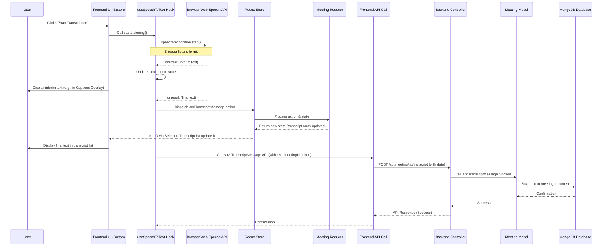

### Looking at the Code

Let's look at the key code snippets that implement this flow.

**1. The `useSpeechToText` Hook (`frontend/src/hooks/useSpeechToText.js`)**

This hook encapsulates the logic for interacting with the Web Speech API.

```javascript
// --- frontend/src/hooks/useSpeechToText.js (Simplified) ---
import { useState, useEffect, useCallback, useRef } from 'react';
import { useDispatch, useSelector } from 'react-redux';
import { addTranscriptMessage } from '../store/meetingSlice'; // Redux action
import { saveTranscriptMessage } from '../api/meeting'; // Backend API call

const useSpeechToText = (meetingId) => {
  const [isListening, setIsListening] = useState(false);
  const [transcript, setTranscript] = useState(''); // For current interim text
  const [error, setError] = useState('');
  const recognitionRef = useRef(null); // Reference to SpeechRecognition object
  const dispatch = useDispatch();
  const user = useSelector(state => state.auth.user); // Get current user info from Redux

  useEffect(() => {
    // 1. Check for browser support
    if (!('webkitSpeechRecognition' in window) && !('SpeechRecognition' in window)) {
      setError('Your browser does not support speech recognition.');
      return;
    }

    // 2. Create SpeechRecognition instance
    const SpeechRecognition = window.SpeechRecognition || window.webkitSpeechRecognition;
    recognitionRef.current = new SpeechRecognition();

    // 3. Configure options
    recognitionRef.current.continuous = true; // Keep listening
    recognitionRef.current.interimResults = true; // Get interim results
    recognitionRef.current.lang = 'en-US'; // Language

    // 4. Set up event handlers
    recognitionRef.current.onstart = () => setIsListening(true);
    recognitionRef.current.onend = () => setIsListening(false);
    recognitionRef.current.onerror = (event) => {
      console.error('Speech recognition error', event.error);
      setError(`Recognition error: ${event.error}`);
      setIsListening(false); // Stop listening on error
    };

    recognitionRef.current.onresult = (event) => {
      let final = '';
      let interim = '';

      // Loop through results
      for (let i = event.resultIndex; i < event.results.length; i++) {
        const currentTranscript = event.results[i][0].transcript;

        if (event.results[i].isFinal) {
          final += currentTranscript; // Accumulate final text segments
        } else {
          interim += currentTranscript; // Accumulate interim text
        }
      }

      // Update the live interim transcript display
      setTranscript(final + interim);

      // If we have a complete final phrase, process it
      if (final.trim()) {
         handleFinalTranscript(final.trim()); // Call handler for final text
         setTranscript(''); // Clear interim display for the next phrase
      }
    };

    // 5. Clean up when hook unmounts
    return () => {
      if (recognitionRef.current && isListening) {
        recognitionRef.current.stop();
      }
    };
  }, [meetingId, isListening]); // Add isListening to dependencies to potentially restart on unexpected end

  // 6. Handler for finalized text
  const handleFinalTranscript = useCallback(async (text) => {
    if (!text) return;

    try {
      const transcriptMessage = {
        // Include user info with the message
        userId: user.uid,
        userName: user.displayName || user.email,
        text,
        timestamp: new Date()
      };

      // Dispatch action to add to Redux state (updates UI live for this client)
      dispatch(addTranscriptMessage(transcriptMessage));

      // Send to backend for persistent storage and syncing to others
      if (meetingId && user && user.token) {
        // The backend will save this line
        await saveTranscriptMessage(meetingId, text, user.token);
        // Note: quickMeet relies on other clients fetching the meeting data
        // or potentially a separate broadcast mechanism if implemented,
        // but the primary save is via this API call. Redux update happens locally first.
      }

    } catch (error) {
      console.error('Error processing or saving transcript:', error);
    }
  }, [meetingId, user, dispatch]); // Dependencies for handleFinalTranscript

  // 7. Functions to control listening state
  const startListening = useCallback(() => {
    if (recognitionRef.current && !isListening) {
      try {
        recognitionRef.current.start();
        setError(''); // Clear previous errors
      } catch (error) {
        console.error('Error starting speech recognition:', error);
        // Handle cases where start() throws errors (e.g., already started)
        if (error.error !== 'already-started') {
             setError(`Failed to start recognition: ${error.message}`);
        }
      }
    }
  }, [isListening]);

  const stopListening = useCallback(() => {
    if (recognitionRef.current && isListening) {
      recognitionRef.current.stop(); // This will trigger the 'onend' event
    }
  }, [isListening]);

  const toggleListening = useCallback(() => {
    if (isListening) {
      stopListening();
    } else {
      startListening();
    }
  }, [isListening, startListening, stopListening]);

  return {
    isListening,
    transcript: transcript.trim(), // Return trimmed interim transcript
    startListening,
    stopListening,
    toggleListening,
    error
  };
};

export default useSpeechToText;
```

This hook does the heavy lifting: it initializes the Web Speech API, sets up listeners, manages the interim vs. final text, updates local state (`transcript`) for live display, and triggers the Redux dispatch and backend save (`handleFinalTranscript`) when a final result is ready.

**2. Sending Final Text to the Backend (`frontend/src/api/meeting.js`)**

This is the simple API function called by the hook.

```javascript
// --- frontend/src/api/meeting.js (Simplified) ---
import axios from 'axios';

const API_URL = `${import.meta.env.VITE_APP_API_URL}/meeting`;

// ... other API calls (getMeeting, getMeetingHistory, etc.) ...

export const saveTranscriptMessage = async (meetingId, text, token) => {
    console.log(`Calling API to save transcript for meeting ${meetingId}: "${text}"`);
    // Sends a POST request to the backend endpoint
    const response = await axios.post(`${API_URL}/${meetingId}/transcript`,
        { text }, // The body of the request contains the text
        { headers: { Authorization: `Bearer ${token}` } } // Include the user's token
    );
    console.log("Transcript save API response:", response.data);
    return response.data.data; // Returns confirmation data from backend
};

// ... other API calls ...
```

This function simply constructs and sends an HTTP POST request to the correct backend endpoint, including the meeting ID in the URL, the text in the request body, and the user's JWT for authentication ([User Authentication & Authorization](02_user_authentication___authorization_.md)).

**3. Backend Endpoint to Receive Transcript (`backend/controllers/meetingController.js`)**

This controller function handles the incoming API request from the frontend.

```javascript
// --- backend/controllers/meetingController.js (Simplified) ---
// ... imports (saveTranscriptMessage from meetingModel, response utilities, etc.) ...

// Requires verifyToken middleware (not shown in snippet but applied to this route)
const saveTranscriptMessage = async (req, res) => {
    try {
        const { meetingId } = req.params; // Get meetingId from URL parameters
        const { text } = req.body; // Get the text from the request body

        if (!text) {
            // Basic validation
            return errorResponse(res, formatMessage(responseMessages.error.ValidationError, {'operation': 'Transcript Message'}), 400);
        }

        // Use the user info attached by the verifyToken middleware
        const messageData = {
            userId: req.user.uid, // User ID from the authenticated user
            userName: req.user.displayName || req.user.email, // User name
            text, // The transcribed text
            timestamp: new Date() // Server-side timestamp
        };

        console.log(`Saving transcript message for meeting ${meetingId}:`, messageData);

        // Call the model function to save to the database
        const result = await addTranscriptMessage(meetingId, messageData); // Calls the database layer

        if (!result) {
            // Meeting not found
            return errorResponse(res, formatMessage(responseMessages.error.NotFound, {'operation': 'Meeting'}), 404);
        }

        console.log(`Transcript message saved successfully for meeting ${meetingId}.`);
        // Send a success response back to the frontend
        return successResponse(res, formatMessage(responseMessages.success.Created, {'operation': 'Transcript Message'}), messageData);
    } catch (err) {
        console.error('Error in saveTranscriptMessage backend:', err);
        return errorResponse(res, formatMessage(responseMessages.error.internalServerError));
    }
}

// ... other controller functions ...

module.exports = {
    // ... other exported functions ...
    saveTranscriptMessage,
};
```

This backend code receives the text, adds the user's identity (validated by the `verifyToken` middleware which is applied to this route), and then calls the appropriate function in the `meetingModel` to interact with the database.

**4. Saving to the Database (`backend/models/meetingModel.js`)**

This function updates the meeting document in MongoDB.

```javascript
// --- backend/models/meetingModel.js (Simplified) ---
const { MeetingModel } = require('../models/schemaLoader'); // Our Mongoose model

// ... other model functions (createMeeting, findMeetingById, etc.) ...

const addTranscriptMessage = async (meetingId, messageData) => {
    console.log(`Adding transcript message to DB for meeting ${meetingId}`);
    // Find the meeting by its ID and push the new message object into the 'transcript' array
    return await MeetingModel.findOneAndUpdate(
        { meetingId }, // Find meeting by this ID
        { $push: { transcript: messageData } }, // Add messageData to the 'transcript' array
        { new: true } // Option to return the updated document
    );
};

// ... other exported functions ...

module.exports = {
    // ... other exported functions ...
    addTranscriptMessage,
};
```

This simple model function uses Mongoose's `findOneAndUpdate` with the `$push` operator to atomically add the new transcript message to the `transcript` array within the specified meeting document in MongoDB. This is how the transcript is persisted ([Persistent Meeting Data](03_persistent_meeting_data_.md)).

**5. Updating Frontend State (`frontend/src/store/meetingSlice.js`)**

The Redux reducer handles the action dispatched by the `useSpeechToText` hook.

```javascript
// --- frontend/src/store/meetingSlice.js (Simplified) ---
import { createSlice } from "@reduxjs/toolkit";

const initialState = {
  // ... other state fields (meeting, meetingHistory, etc.)
  transcript: [], // Array to hold transcript entries
  // ...
};

const meetingSlice = createSlice({
  name: "meeting",
  initialState,
  reducers: {
    // ... other reducers (updateMeetingParticipants, etc.) ...

    // Reducer to add a new message to the transcript array
    addTranscriptMessage: (state, action) => {
      const message = action.payload;
      console.log("Adding transcript message to Redux state:", message);
      // Use Immer (built into Redux Toolkit) to safely push to the array
      state.transcript.push(message);
      // Note: In a system with multiple speakers, you'd need more sophisticated logic
      // to ensure chronological order and potentially merge from different sources.
      // quickMeet saves locally then to backend, and the meeting details page
      // loads the full transcript from the backend, which is the authoritative source.
    },

    // Reducer to set the initial transcript (e.g., when loading meeting details)
    setTranscript: (state, action) => {
        console.log("Setting full transcript in Redux state:", action.payload.length, "entries");
        state.transcript = action.payload;
    },

    // ... other reducers ...
  },
});

// Export the action creator
export const { addTranscriptMessage, setTranscript /*, other actions */ } = meetingSlice.actions;

// Export the reducer
export default meetingSlice.reducer;
```

This reducer receives the `addTranscriptMessage` action and updates the `transcript` array in the Redux store using Immer's mutable-looking syntax. It also includes `setTranscript` which is used, for instance, when you load the meeting details page and fetch the *entire* saved transcript history from the backend ([Persistent Meeting Data](03_persistent_meeting_data_.md)).

**6. Displaying the Transcript (`frontend/src/components/TranscriptPanel.jsx` and `frontend/src/components/CaptionsOverlay.jsx`)**

These components use the `useSpeechToText` hook for the live interim text and `useSelector` to read the finalized transcript history from the Redux store.

```jsx
// --- frontend/src/components/TranscriptPanel.jsx (Simplified) ---
import { useState } from 'react';
import { useSelector } from 'react-redux'; // Import useSelector
import useSpeechToText from '../hooks/useSpeechToText'; // Import the hook

const TranscriptPanel = ({ meetingId }) => {
  const [activeTab, setActiveTab] = useState('transcript');
  // Read the full transcript history from Redux state
  const transcriptHistory = useSelector(state => state.meeting.transcript);
  // Use the hook for live listening status and current interim text
  const {
    isListening,
    toggleListening, // Function to start/stop listening
    transcript: currentInterimTranscript, // The live, non-final text
    error
  } = useSpeechToText(meetingId);

  return (
    <div className="...">
      {/* Tabs for Transcript / Summary */}
      <div className="flex border-b ...">
        {/* ... tab buttons ... */}
      </div>

      {/* Content Area */}
      <div className="flex-1 overflow-auto p-4">
        {activeTab === 'transcript' && (
          <div>
            <div className="flex items-center justify-between mb-4">
              <h3>Live Transcript</h3>
              {/* Button to toggle listening, uses the hook's function */}
              <button onClick={toggleListening} className="...">
                {isListening ? 'Stop Listening' : 'Start Listening'}
              </button>
            </div>

            {error && (<div className="bg-red-100 ...">{error}</div>)}

            {/* Display the live interim text while listening */}
            {isListening && currentInterimTranscript && (
              <div className="bg-gray-50 ... italic mb-4">
                <p className="text-gray-600 dark:text-gray-400">
                  {currentInterimTranscript}
                </p>
              </div>
            )}

            {/* Display the finalized transcript history from Redux */}
            <div className="space-y-4">
              {transcriptHistory.length > 0 ? (
                // Map over the history from Redux, reversing to show newest first
                transcriptHistory.slice().reverse().map((item, index) => (
                  <div key={index} className="bg-gray-100 ...">
                    <div className="flex justify-between mb-1">
                      {/* Use user name from the Redux transcript entry */}
                      <span className="font-medium ...">{item.userName}</span>
                      <span className="text-xs ...">{new Date(item.timestamp).toLocaleTimeString()}</span>
                    </div>
                    {/* Display the final text */}
                    <p className="text-gray-700 dark:text-gray-300">{item.text}</p>
                  </div>
                ))
              ) : (
                <p className="text-center text-gray-500 ...">
                  No transcripts yet. Start speaking to generate a transcript.
                </p>
              )}
            </div>
          </div>
        )}

        {/* ... Summary tab content ... */}
      </div>
    </div>
  );
};

export default TranscriptPanel;
```

The `TranscriptPanel` uses `useSpeechToText` to manage the *control* (start/stop) and display the *live interim* text. It uses `useSelector` to get the *saved history* of transcript entries from Redux, which includes entries from *all* users who transcribed and saved. The `CaptionsOverlay` (not shown here, but see code snippets) works similarly but focuses only on displaying the most recent few lines from the `transcript` array in Redux as an overlay on the video.

### Summary

**Speech-to-Text & Transcription** in quickMeet is enabled by the browser's **Web Speech API**. A custom React hook, `useSpeechToText`, wraps this API, handling the microphone listening, capturing **interim** and **final** text results. Finalized text is then:

1.  Dispatched to the Redux store using an action (`addTranscriptMessage`) to update the local frontend state, allowing immediate display in the transcript panel or captions ([Frontend State Management (Redux)](05_frontend_state_management__redux__.md)).
2.  Sent via an API call (`saveTranscriptMessage`) to the backend for **persistent storage** in the meeting's document in MongoDB ([Persistent Meeting Data](03_persistent_meeting_data_.md)).

This architecture ensures that the transcript is both visible live during the meeting and saved for later review in the meeting history.

We have now explored all the core concepts that power quickMeet, from real-time communication and user management to media streaming, persistent data, frontend state, and finally, transcription.

This concludes the core concepts tutorial for quickMeet! You now have a foundational understanding of the main technical pieces that make this application work.

---
